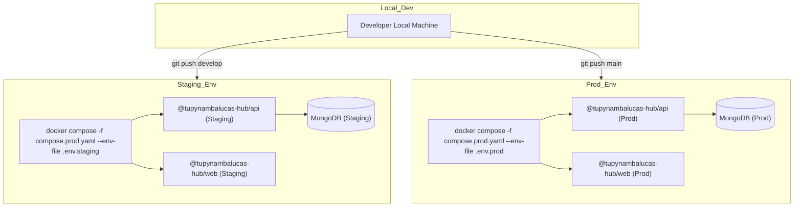

The architecture is built on the standalone dev/staging/production promotion model:

- **Staging (Homologação):** Mirror of the production stack. Runs on a dedicated subdomain connected to a staging database cluster. Used to validate new feature sets and schema migrations.
- **Production (Produção):** The authoritative client-facing environment. Fully locked down and optimized for performance.



---

## 2. Build-Time Compilation & Image Packaging

Our frontend and backend deployment units are fully containerized using optimized Dockerfiles.

### 2.1. Frontend Build Arg Injection

Vite statically bakes public environment variables (prefixed with `VITE_`) into the JavaScript bundles during the compilation phase. For this reason, these parameters must be supplied as Docker build arguments during image generation:

```dockerfile
# Inside Frontend Dockerfile
ARG VITE_TURNSTILE_SITE_KEY
ENV VITE_TURNSTILE_SITE_KEY=$VITE_TURNSTILE_SITE_KEY
RUN pnpm build
```

:::warning[Security Boundary]
Never inject sensitive keys (such as JWT secrets, database credentials, or email credentials) into the frontend build. Frontend environments are fully public. All secrets must be kept strictly on the backend API layer and injected at runtime.
:::

---

## 3. Orquestração de Contêineres e Layouts de Diretórios

Os espaços de trabalho (workspaces) que contêm infraestrutura Docker são estruturados de duas
formas com base em seus domínios operacionais. Consulte
[Monorepos Orientados a Domínio](/docs/explanation/domain-driven-monorepo#6-padrões-de-layout-de-contêineres-flat-services-vs-layered-domains)
para a teoria de design por trás desta escolha.

### 3.1. Layout de Flat Services (Serviços Planos)

Os serviços são organizados dentro de uma pasta plana `services/`, com as configurações gerais de
orquestração localizadas em `infrastructure/`:

- **Esquema de Caminhos**:
  - `workspace/services/[service-name]/Dockerfile`
  - `workspace/infrastructure/docker/compose.yaml`
- **Aplicação**: Utilizado em
  [hub](/docs/explanation/domain-driven-monorepo#31-topologia-de-pastas) e
  `studio/design`.

### 3.2. Layout de Layered Domain (Domínios em Camadas)

Os serviços são agrupados em diretórios irmãos representando camadas arquiteturais diretamente na
raiz do workspace:

- **Esquema de Caminhos**:
  - `workspace/[domain-layer]/services/[service-name]/Dockerfile`
  - `workspace/infrastructure/docker/compose.yaml`
- **Aplicação**: Utilizado em `cortex` (dividido em planos `gateway/`, `mcp/` e `agents/`).

---

## 4. Servidor Proxy Reverso e Roteamento de Requisições

tupynambalucas.dev utiliza uma configuração de proxy reverso (seja **Nginx** ou **Traefik**) para
tratar a terminação TLS, compressão e roteamento de requisições.

- **Certificados SSL:** Gerenciados dinamicamente via Let's Encrypt usando desafios ACME
  automatizados.
- **Mapeamento de Portas:** As portas públicas `80` (HTTP) e `443` (HTTPS) mapeiam para os
  contêineres de borda web, que internamente encaminham as chamadas para a API Fastify ou servem
  os ativos estáticos compilados do React.

:::info[Redeploys com Zero Downtime]
O Docker Compose atualiza automaticamente os contêineres com o mínimo de inatividade ao executar
`pnpm hub:prod` com contêineres existentes. Para eliminar totalmente quedas de requisição,
implemente um padrão de deploy rotativo (rolling deployment) utilizando um balanceador de carga.
:::

---

## 5. Inicialização do Banco de Dados e Migrações de Schema

Para evitar a necessidade de intervenção operacional manual durante lançamentos, toda a
preparação do banco de dados é tratada de forma dinâmica a nível de aplicação.

- **Configuração de Replica Set:** Durante o desenvolvimento local e rollouts iniciais em staging,
  o contêiner auxiliar `db-init` garante automaticamente que o replica set (`rs0`) seja
  estabelecido, permitindo suporte a transações.
- **Seeding de Dados (`SeedPlugin`):** O servidor Fastify conta com um plugin de seeding integrado
  nativamente. Na inicialização, ele dispara um padrão upsert idempotente, criando o usuário
  administrador padrão se ele não existir, sem risco de duplicação de linhas.
