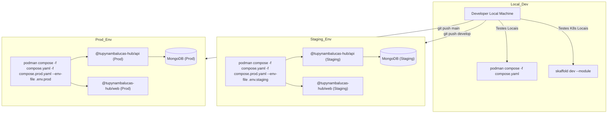

# Referência de Infraestrutura

Este documento detalha os padrões de design de infraestrutura, estratégias de containerização e arquiteturas de roteamento usadas nos workspaces do monorepo.

---

## 1. Modelo de Promoção de Ambiente

A arquitetura é construída sob um modelo modular de promoção de ambiente (dev/staging/production):

- **Local Dev:** Gerenciado via **Podman Compose** (para iteração rápida de microsserviços) ou **Skaffold + Minikube** (para validação de integração no Kubernetes).
- **Staging (Homologação):** Espelho da stack de produção. Roda sob um subdomínio dedicado conectado a um cluster de banco de dados de homologação. Usado para validar novos conjuntos de funcionalidades e migrações de esquemas.
- **Production (Produção):** O ambiente autoritativo voltado ao cliente. Totalmente protegido e otimizado para performance.


```mermaid
graph TD
    direction TB
    subgraph Local_Dev
        Code["Developer Local Machine"]
        LocalCompose["podman compose -f compose.yaml"]
        LocalK8s["skaffold dev --module <name>"]
    end
    subgraph Staging_Env
        StgCompose["podman compose -f compose.yaml -f compose.prod.yaml --env-file .env.staging"]
        StgAPI["@tupynambalucas-hub/api (Staging)"]
        StgWeb["@tupynambalucas-hub/web (Staging)"]
        StgDB[("MongoDB (Staging)")]
    end
    subgraph Prod_Env
        ProdCompose["podman compose -f compose.yaml -f compose.prod.yaml --env-file .env.prod"]
        ProdAPI["@tupynambalucas-hub/api (Prod)"]
        ProdWeb["@tupynambalucas-hub/web (Prod)"]
        ProdDB[("MongoDB (Prod)")]
    end

    Code -->|Testes Locais| LocalCompose
    Code -->|Testes K8s Locais| LocalK8s
    Code -->|git push develop| Staging_Env
    Code -->|git push main| Prod_Env

    StgCompose --> StgAPI
    StgCompose --> StgWeb
    StgAPI --> StgDB

    ProdCompose --> ProdAPI
    ProdCompose --> ProdWeb
    ProdAPI --> ProdDB
```

---

## 2. Compilação em Tempo de Build & Empacotamento de Imagens

Nossas unidades de implantação de frontend e backend são totalmente containerizadas usando Dockerfiles otimizados.

### 2.1. Injeção de Argumentos de Build no Frontend

O Vite insere variáveis de ambiente públicas (prefixadas com `VITE_`) estaticamente nos pacotes JavaScript durante a fase de compilação. Por esse motivo, estes parâmetros devem ser fornecidos como argumentos de build do Docker durante a geração da imagem:

```dockerfile
# Inside Frontend Dockerfile
ARG VITE_TURNSTILE_SITE_KEY
ENV VITE_TURNSTILE_SITE_KEY=$VITE_TURNSTILE_SITE_KEY
RUN pnpm build
```

:::warning[Limite de Segurança]
Nunca injete chaves sensíveis (como segredos JWT, credenciais de banco de dados ou credenciais de e-mail) no build do frontend. Os ambientes de frontend são totalmente públicos. Todos os segredos devem ser mantidos estritamente na camada da API do backend e injetados em tempo de execução.
:::

---

## 3. Orquestração de Containers & Layouts de Diretórios

Os workspaces contendo configurações do Docker e do Kubernetes são estruturados de uma de duas maneiras com base em seus domínios operacionais. Consulte [Monorepos Orientados a Domínio](/docs/explanation/domain-driven-monorepo) para a teoria de design por trás desta escolha.

### 3.1. Layout de Serviços Planos (Flat Services)

Os serviços são colocados dentro de uma pasta plana `services/`, com configurações gerais de orquestração localizadas em `infrastructure/`:

- **Esquema de Caminho**:
  - `workspace/services/[service-name]/Dockerfile`
  - `workspace/infrastructure/docker/compose.yaml`
- **Aplicação**: Usado em `hub` e `studio`.

### 3.2. Layout de Domínio em Camadas (Layered Domain)

Os serviços são agrupados em pastas que representam camadas arquitetônicas distintas diretamente na raiz do workspace:

- **Esquema de Caminho**:
  - `workspace/[domain-layer]/services/[service-name]/Dockerfile`
  - `workspace/infrastructure/docker/compose.yaml`
- **Aplicação**: Usado em `cortex` (separando as camadas de `gateway/`, `mcp/` e `agents/`).

### 3.3. Layout de Manifestos Kubernetes

Workspaces que suportam implantação em Kubernetes usam uma estrutura de diretórios baseada no Kustomize que espelha sua organização em camadas:

- **Esquema de Caminho**:
  - `workspace/infrastructure/kubernetes/kustomization.yaml` (Agregador)
  - `workspace/infrastructure/kubernetes/namespace.yaml` (Namespace Isolado)
  - `workspace/infrastructure/kubernetes/[service].yaml` (Deployments + Services)
- **Aplicação**: Usado em `cortex` (canônico) e `platform`.

---

## 4. Proxy Reverso & Roteamento de Requisições

tupynambalucas.dev utiliza uma configuração de proxy reverso para lidar com terminação TLS, compressão e roteamento de requisições.

- **Certificados SSL:** Gerenciados dinamicamente via Let's Encrypt usando desafios ACME automatizados.
- **Mapeamento de Portas:** As portas públicas `80` (HTTP) e `443` (HTTPS) mapeiam para os containers web de borda, que internamente encaminham as requisições para a API Fastify ou servem os assets React estáticos compilados.
- **MCP Gateway Ingress (`agentgateway`):** Atua como o ponto de entrada unificado para clientes MCP (baseados em SSE) e requisições LLM, direcionando-as internamente para o microsserviço ou servidor MCP correto.
- **Ingress do Kubernetes:** No modo Kubernetes, o Traefik roteia requisições HTTP/gRPC de entrada usando recursos de `Ingress` mapeados para os Serviços de destino.

---

## 5. Inicialização de Banco de Dados & Migrações de Esquema

Para evitar sobrecarga operacional manual durante as releases, toda a preparação do banco de dados é tratada de forma dinâmica a nível de aplicação.

- **Configuração de Replica Set:** Durante o desenvolvimento local e implantações iniciais em staging, o container auxiliar `db-init` garante automaticamente que o replica set (`rs0`) seja estabelecido, habilitando o suporte a transações.
- **Semeamento de Dados (`SeedPlugin`):** O servidor Fastify possui um plugin de semeamento integrado nativamente. Na inicialização, ele aciona um padrão upsert idempotente, criando o usuário administrador padrão se ele não existir, sem risco de linhas duplicadas.
