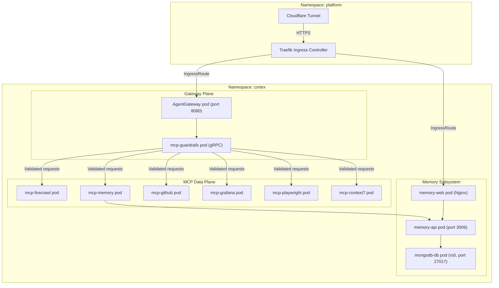

The Cortex workspace consolidates all artificial intelligence operations into a
unified Bounded Context. By co-locating the API Ingress Gateway, persistent
memory layer, Model Context Protocol (MCP) data plane, and containerized agent
workspaces under a single Kubernetes namespace, the system guarantees environment
predictability, network isolation, and security.

---

## 1. Network Topology & Isolation

All Cortex services run inside the `cortex` Kubernetes namespace. Inbound traffic
enters through Traefik (deployed in the `platform` namespace) and is routed
through the AgentGateway before reaching any downstream MCP pod or the Memory
Subsystem.



### Isolation Model

- All inter-service communication uses Kubernetes DNS names (e.g.,
  `memory-api:3006`, `agentgateway:8080`). No service exposes a NodePort
  directly to the host except during local Skaffold development sessions.
- Downstream MCP pods and the Memory Subsystem pods are only reachable through
  the AgentGateway or Traefik IngressRoutes. No direct pod-to-pod access from
  agent containers is permitted.
- The `platform` namespace hosts Traefik, OpenTelemetry Collector, and Grafana
  stack. Telemetry data flows from Cortex pods to the platform namespace via
  OTLP.

---

## 2. Directory Layout

```text
cortex/
 gateway/                 # AgentGateway configuration (config.yaml, guardrails)
 mcp/
    guardrails/          # gRPC ExtMCP policy processor
    inspector/           # MCP Inspector web UI (dev only)
    services/            # Downstream MCP adapter packages
        context7/
        firecrawl/
        github/
        grafana/
        memory/
        playwright/
 memory/
    packages/core/       # Shared TypeScript models and Zod schemas
    services/
        api/             # memory-api Fastify backend
        mongodb/         # MongoDB 7.0 rs0 init scripts
        web/             # memory-web React dashboard
 infrastructure/
    kubernetes/          # Skaffold + Kustomize manifests
        base/            # Base Kustomize resources
        overlays/        # dev / staging / prod overlays
 package.json
 AGENTS.md
```

---

## 3. Ingress Routing & Tool Federation

The **AgentGateway** is the sole entry point for all AI tool calls. It validates,
enriches, and routes requests through the following pipeline:

1. **Cloudflare Tunnel -> Traefik**: Public HTTPS traffic enters through a
   Cloudflare Tunnel terminating at the Traefik Ingress Controller in the
   `platform` namespace.
2. **Traefik -> AgentGateway**: An IngressRoute forwards agent API traffic to the
   AgentGateway pod on port `8080`.
3. **ExtMCP Guardrails**: AgentGateway delegates every `tools/call` request to the
   `mcp-guardrails` gRPC sidecar, which:
   - Recursively traverses tool arguments and rewrites `localhost` / `127.0.0.1` strings to `host.docker.internal` as a transparent network proxy.
   - Returns `{ pass: {} }` on any parsing exception (fail-open contract).
4. **Downstream Dispatch**: Validated requests are forwarded to the appropriate
   MCP adapter pod (e.g., `mcp-firecrawl`, `mcp-memory`) via Kubernetes
   service DNS.

### Tool Configuration in Agent Containers

Agent containers reference AgentGateway as the single MCP endpoint:

```json
{
  "mcpServers": {
    "cortex": { "url": "http://agentgateway:8080/mcp" }
  }
}
```

AgentGateway federates the request to the correct downstream MCP pod
transparently. Agents do not need individual service URLs.
