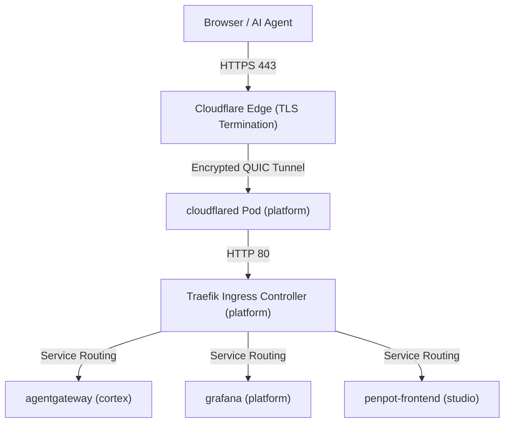

# Infrastructure Architecture

%PROJECT_DOMAIN% utilizes a Kubernetes-native orchestration pipeline and an edge-to-cluster reverse proxy architecture to handle TLS termination, Zero Trust security, and request routing across bounded contexts.

---

## 1. Kubernetes Manifest Layout

Workspaces that support Kubernetes deployment use a Kustomize-based directory layout mirroring their layered structure. All configurations reside within the centralized `infrastructure` bounded context.

- **Path Schema**:
  - `infrastructure/environments/<env>/<context>` (Kustomize Overlays)
  - `infrastructure/manifests/<context>.yaml` (Deployments + Services + Ingress)
- **Application**: Used universally across all contexts (`platform`, `cortex`, `studio`).

---

## 2. Reverse Proxy & Request Routing

We use an edge-to-cluster reverse proxy architecture to handle public and internal request routing.

### 2.1. Cloudflare Tunnel & Edge Topology

Public access to local and remote Kubernetes development environments is provided via **Cloudflare Tunnel** (`cloudflared`) integrated with **Cloudflare Zero Trust**:

- **Edge TLS Termination:** Cloudflare Edge terminates public HTTPS for `*-dev.%PROJECT_DOMAIN%` using single-level wildcard SSL/TLS certificates (`*.%PROJECT_DOMAIN%`).
- **Encrypted Tunnel Transport:** Traffic travels from Cloudflare Edge to the cluster via an encrypted QUIC connection handled by the `cloudflared` deployment in the `platform` namespace.
- **Traefik Ingress Controller:** `cloudflared` forwards requests internally to Traefik on port 80 (`http://traefik.platform.svc.cluster.local:80`), which routes HTTP/gRPC payloads to target Services based on standard Kubernetes `Ingress` resources.

### 2.2. Authoritative Development Domain Scheme

All development services adopt a single-level hyphenated subdomain structure (`*-dev.%PROJECT_DOMAIN%`) to ensure 100% compatibility with free Universal SSL certificates:

| Domain Host                             | Target Service         | Namespace  | Purpose                                |
| :-------------------------------------- | :--------------------- | :--------- | :------------------------------------- |
| `agentgateway-dev.%PROJECT_DOMAIN%`     | `agentgateway:15000`   | `cortex`   | AgentGateway Admin UI & Control Plane  |
| `agentgateway-mcp-dev.%PROJECT_DOMAIN%` | `agentgateway:8080`    | `cortex`   | Direct MCP Ingress Endpoint (`/mcp`)   |
| `grafana-dev.%PROJECT_DOMAIN%`          | `grafana:3000`         | `platform` | Grafana Observability Dashboard        |
| `headlamp-dev.%PROJECT_DOMAIN%`         | `headlamp:80`          | `platform` | Headlamp Kubernetes Dashboard          |
| `traefik-dev.%PROJECT_DOMAIN%`          | `traefik:8082`         | `platform` | Traefik Ingress Dashboard              |
| `penpot-dev.%PROJECT_DOMAIN%`           | `penpot-frontend:8080` | `studio`   | Penpot Design Tool                     |
| `memos-dev.%PROJECT_DOMAIN%`            | `memos:5230`           | `studio`   | Memos Note-taking App                  |
| `docs.%PROJECT_DOMAIN%`                 | Cloudflare Pages       | External   | Docusaurus Technical Documentation Hub |

### 2.3. Cloudflare Access & Zero Trust Policies

To secure development endpoints exposed via Cloudflare Tunnel:

- **Web Dashboards (Grafana, Headlamp, Traefik, AgentGateway Admin):** Protected by Cloudflare Access **Email / One-Time PIN (OTP)** policies. Only authorized developer email addresses receive authentication PINs.
- **AI & MCP Endpoints (`agentgateway-mcp-dev.%PROJECT_DOMAIN%`):** Configured with a **Bypass** policy or Service Token authentication in Cloudflare Zero Trust with tunnel routing directed to `/mcp`. This enables non-browser clients (such as AI agents, CLI tools, and automated pipelines) to exchange JSON-RPC / SSE payloads without encountering interactive browser login redirects.
