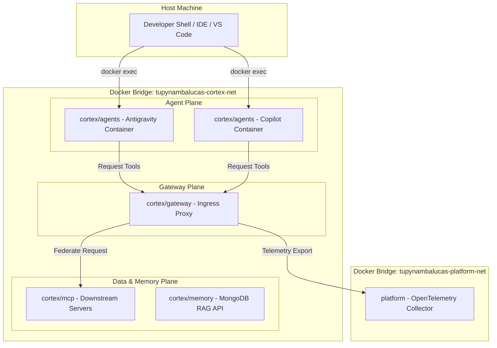

### Unified AI Architecture

The Cortex workspace consolidates all artificial intelligence operations into a unified Bounded Context. By co-locating the API Ingress Gateway, persistent memory layer, Model Context Protocol (MCP) data plane, and containerized terminal agent workspaces, the system guarantees environment predictability and security.

---

## 1. Network Topology & Isolation

To secure developer workstations, AI agent containers run within a sandboxed virtual bridge network, preventing direct access to host resources.



### Network Planes

- **Internal Bridge (`tupynambalucas-cortex-net`)**: The private network where all Cortex services communicate. Downstream MCP servers and memory databases do not expose ports to the host; they are accessed exclusively through the gateway.
- **External Bridge (`tupynambalucas-platform-net`)**: Connects the gateway to platform-wide services like the OpenTelemetry Collector for telemetry aggregation.

---

## 2. Directory Layout & Mount Mappings

```text
cortex/
├── gateway/                 # API Ingress Gateway config
├── mcp/                     # MCP server specifications
├── memory/                  # MongoDB Vector RAG memory workspace
└── agents/                  # AI agent runtime CLI setup
    ├── compose.yaml         # Orchestration for agent containers
    ├── mcp_config.json      # Unified MCP configuration
    ├── skills/              # Shared agent skills
    ├── copilot/
    │   ├── Dockerfile       # GitHub CLI + Copilot CLI
    │   └── data/            # Git-ignored session tokens
    └── antigravity/
        ├── Dockerfile       # Antigravity CLI
        └── data/            # Git-ignored local brain/logs
```

### Configuration Injection

All settings and credentials are dynamically bind-mounted at container startup. No private authentication keys are baked into the image layers.

| Mount Source           | Container Destination                | Purpose                            |
| :--------------------- | :----------------------------------- | :--------------------------------- |
| `../../`               | `/workspace`                         | Monorepo working directory         |
| `./skills/`            | `/workspace/.agents/skills`          | Shared agent skills                |
| `./mcp_config.json`    | `/workspace/.agents/mcp_config.json` | Unified MCP configurations         |
| `./antigravity/data/`  | `/root/.gemini/antigravity-cli/`     | Antigravity session & brain state  |
| `./copilot/data/`      | `/root/.copilot/`                    | Copilot session tokens             |
| `/var/run/docker.sock` | `/var/run/docker.sock`               | Docker-out-of-Docker orchestration |
| `~/.ssh`               | `/root/.ssh` (read-only)             | Host SSH credentials for Git tasks |
| `~/.gitconfig`         | `/root/.gitconfig` (read-only)       | Host Git profile configuration     |

---

## 3. Ingress Routing & Tool Federation

The **AgentGateway** serves as the central router for all AI clients. It translates requests and routes tasks securely:

- **Unified Ingress Proxy**: A Go-based gateway proxy runs on the container port `8080` (mapped to host `8080`). It acts as a single point of entry, routing requests to the target MCP servers.
- **Tool Federation Configuration**: Inside the agent containers, the configuration maps downstream tools through the gateway:
  ```json
  {
    "mcpServers": {
      "github": { "url": "http://agentgateway:8080/mcp/http" },
      "context7": { "url": "http://agentgateway:8080/mcp/http" }
    }
  }
  ```
- **Stream Stability**: The gateway disables default connection timeouts and intercepts requests to inject global CORS headers, ensuring stable, persistent Server-Sent Events (SSE) connections.
