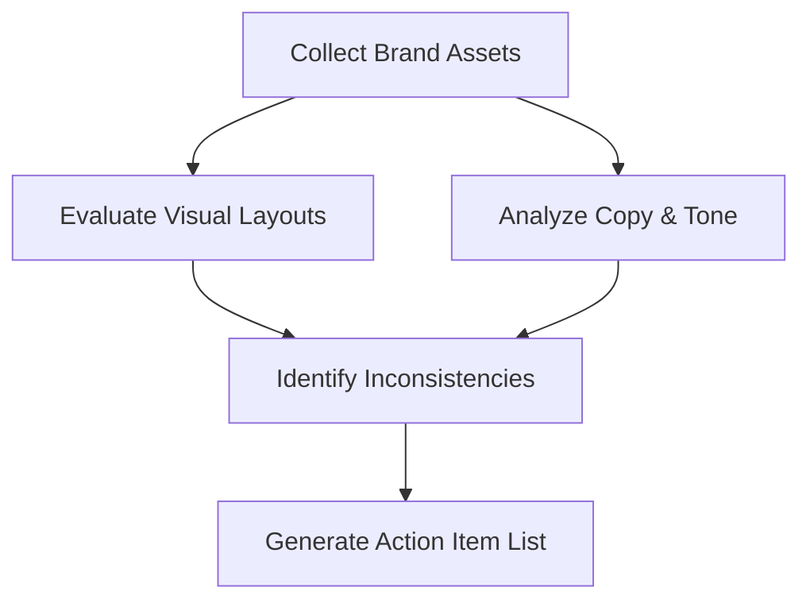

# Brand Identity How-To Guides

This document provides goal-oriented, practical step-by-step guides to solve specific brand
identity implementation and maintenance tasks.

---

## How to Document a Brand Style Guide

A brand style guide ensures that external collaborators and internal teams apply the brand
elements consistently. Use this process to build and document a guide.

### Step 1: Create the Document Structure

Organize your brand style guide into four logical sections:

1. **Strategic Core**: Mission, vision, purpose, and personality traits.
2. **Verbal Identity**: Tone of voice principles, messaging pillars, and brand grammar.
3. **Visual Identity**: Logo usage, color specifications, typography hierarchy, and imagery rules.
4. **Asset Directory**: Links to official vector files, templates, and font packages.

### Step 2: Define Logo Restrictions

Document clear rules to prevent the distortion of your logo. Include examples showing:

- **Minimum Clear Space**: Define the padding around the logo using a relative unit (e.g., "half the
  height of the logo icon").
- **Prohibited Modifications**: Show visual examples of incorrect usage, such as stretching, rotating,
  changing colors outside the official palette, or placing the logo on low-contrast busy backgrounds.
- **Minimum Size limits**: Specify the smallest size at which the logo can be printed or displayed on
  screens.

### Step 3: Specify Technical Color Values

For every color in your brand palette, document the exact color codes for different media formats:

- **HEX Codes**: For web development and CSS files (e.g., `#0F172A`).
- **RGB Values**: For digital screen displays and video production.
- **CMYK Values**: For standard commercial print materials.
- **Pantone (PMS)**: For precise color matching in professional packaging and physical signage.

---

## How to Establish a Brand Grammar Guide

A Brand Grammar guide defines technical language rules to ensure writing remains consistent across
all product interfaces and marketing channels.

### Step 1: Choose a Regional English Foundation

Standardize on a single regional dictionary and style manual depending on your primary target market:

- **American English (US)**: Default to the AP Stylebook or Chicago Manual of Style. Use spelling like
  _optimize_, _color_, and _modeling_.
- **British English (UK)**: Default to the Oxford Style Manual. Use spelling like _optimise_, _colour_,
  and _modelling_.

### Step 2: Establish Capitalization Rules for Headers

Define standard casing rules for titles, buttons, and system text to maintain visual consistency:

- **Title Case**: Capitalize the first letter of most words (e.g., "The Complete Guide to Brand
  Design"). Use this for main landing page titles and blog headers.
- **Sentence Case**: Capitalize only the first word (e.g., "Get started with your integration"). Use
  this for description paragraphs, inputs, and button labels.

### Step 3: Define Contraction and Pronoun Usage

Select your stance on contractions based on your desired level of formality:

- **Conversational Tone**: Use contractions (_we're_, _it's_, _you'll_) and direct address pronouns
  (_you_, _our_) to sound friendly and approachable.
- **Formal Tone**: Avoid contractions (_we are_, _it is_, _you will_) and use neutral pronouns to
  maintain a professional distance.

---

## How to Conduct a Brand Identity Audit

Run an identity audit bi-annually to identify and fix visual inconsistencies and verbal tone drift.

### Step 1: Compile Brand Assets across Channels

Gather screenshot assets and copy samples from all active customer-facing channels:

- Website homepages and landing pages.
- Desktop and mobile app UI screens.
- Social media profiles and post feeds.
- Automated system emails and customer support chat templates.

### Step 2: Audit Visual Compliance

Compare the gathered assets against the official Brand Style Guide:

- Verify that only official logo files and variants are in use.
- Test color consistency by checking CSS hex values against brand guidelines.
- Scan for non-compliant typefaces and layout alignment issues.

### Step 3: Audit Verbal Alignment

Analyze copy samples to check for tone drift:

- Evaluate whether the text is aligned with the defined brand personality adjectives.
- Check if system text and notifications comply with the Brand Grammar guidelines (e.g., proper
  casing, contraction rules).
- Identify and flag any jargon, clichés, or overly casual phrasing.

### Step 4: Output the Remediation Backlog

Consolidate all findings into a prioritized issue list. Group issues by severity (e.g., critical
mismatched colors on pricing pages, low-priority font sizing issues on blog archives) and assign
them to the design and development backlogs.

---

## How to Adapt Visuals and Copy for Product Extensions

When launching new product lines, use this workflow to extend your visual and verbal identity
system without breaking the parent brand's recognition.

### Step 1: Identify Core Brand Signifiers (Visual Anchors)

Isolate the visual elements that must remain identical across all product lines to preserve parent
brand recognition:

- **Typography**: Keep the primary and secondary font pairings consistent.
- **Layout System**: Maintain the same spacing grids, card structures, and visual clean space ratios.
- **Brand Mark**: Always feature the parent logo or brand icon in a fixed position (e.g., top-left
  header).

### Step 2: Define Extension Signifiers (Visual Variables)

Select visual elements that can be customized to differentiate the new product line:

- **Accent Color**: Introduce a new accent color to represent the extension (e.g., Klarna using pink
  for consumer finance, while introducing secondary shades for partner merchant pages).
- **Secondary Imagery**: Design distinct patterns or illustration assets specifically for the new
  product topic, while maintaining the same style weight and brush strokes.

### Step 3: Align and Tone-Shift the Copy

Adjust the verbal identity to fit the new product's specific target audience while maintaining
core voice principles:

- **Keep the Voice**: Keep the underlying voice traits consistent (e.g., clear, authentic).
- **Shift the Register**: Adjust the formality level depending on the context. For instance, a brand
  selling organic chili oil (e.g., Himalayan Harvest) should keep its earthy tone but can use
  richer culinary language when introducing a sweet honey glaze line, while keeping the simple
  sentence structures intact.
- **Maintain Grammar**: Do not modify basic brand rules, such as US/UK regional spelling standards,
  capitalization styles, or contraction use.
