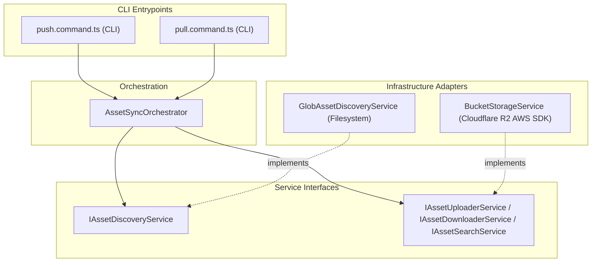

### Cloudflare R2 Storage Infrastructure

The `tupynambalucas.dev` project relies on Cloudflare R2 Object Storage (an S3-compatible, zero-egress fee object storage service) to manage binary assets, high-fidelity design projects, and self-hosted editor persistence.

This document details our bucket ecosystem, the design/creative asset synchronization engine CLI, and the Penpot editor object storage infrastructure.

---

## 1. Buckets Ecosystem

We maintain three dedicated Cloudflare R2 buckets, each serving a distinct domain within our architecture:

| Bucket Name                   | Access Level       | Purpose & Function                                                                                                                     | Credentials Location                       |
| :---------------------------- | :----------------- | :------------------------------------------------------------------------------------------------------------------------------------- | :----------------------------------------- |
| **`tupynambalucas-assets`**   | Public (CDN)       | Hosts web-ready assets (optimized images, SVGs, GLB models, EXR files). Served publicly to frontends like `@tupynambalucas/hub`.       | `studio/bucket/.env.studio.bucket`         |
| **`tupynambalucas-creative`** | Private            | Vault for raw master files (Blender `.blend`, Illustrator `.ai`, Photoshop `.psd`, Premiere `.prproj`). Restricted to core developers. | `studio/bucket/.env.studio.bucket`         |
| **`tupynambalucas-penpot`**   | Private (Internal) | Holds user uploads, layouts, custom vector libraries, and document backups for the self-hosted Penpot design tool.                     | `studio/design/infrastructure/docker/.env` |

---

## 2. Asset Synchronizer CLI (`@tupynambalucas-studio/bucket`)

The `@tupynambalucas-studio/bucket` package is a TypeScript command-line utility that handles bidirectional synchronization (`push` and `pull`) for `tupynambalucas-assets` and `tupynambalucas-creative`.

### A. Core Software Architecture

The sync engine separates filesystem operations from storage providers through dependency injection, utilizing the AWS S3 Client SDK and Glob search patterns.



- **`AssetSyncOrchestrator`**: Runs the sync sequences, comparing local filesystem items with remote S3 metadata.
- **`GlobAssetDiscoveryService`**: Scans directories for files matching patterns defined in the manifest.
- **`BucketStorageService`**: Wraps the AWS S3 client SDK to read metadata headers and upload/download streams.

### B. Environment Configuration

To configure the synchronizer, define the environment variables inside `studio/bucket/.env.studio.bucket`:

```bash
# Cloudflare R2 account identifier
CLOUDFLARE_R2_ACCOUNT_ID=2a6c94a31c5d23bc9d9d1c208036a274

# Public Web Assets Bucket Configuration (CI/CD and CDN Safe)
CLOUDFLARE_R2_ASSETS_ACCESS_KEY_ID=c231f170809523e5497b1284466d95d5
CLOUDFLARE_R2_ASSETS_SECRET_ACCESS_KEY=91a48c17ec116bb500d1b1b2a0219e1f2c973b0a962f2330eae3c44682124d86
CLOUDFLARE_R2_ASSETS_BUCKET_NAME=tupynambalucas-assets
CLOUDFLARE_R2_ASSETS_PUBLIC_URL=https://pub-edba48e442fb4916915a399533123daa.r2.dev

# Private Creative/Design Bucket Configuration (Restricted to Designers)
CLOUDFLARE_R2_CREATIVE_ACCESS_KEY_ID=535cfe37f3856a9db34b9ff5b1f23464
CLOUDFLARE_R2_CREATIVE_SECRET_ACCESS_KEY=59fad25126ad07df994e4c71f9176c833bc0bb167bcec68f904923d066d12caf
CLOUDFLARE_R2_CREATIVE_BUCKET_NAME=tupynambalucas-creative
```

### C. Optimization and API Safety

To operate within Cloudflare R2's free tier (10GB storage, 1M Class A operations/month, 10M Class B operations/month):

- **Hash Verification**: The CLI calculates the MD5 checksum of local files and compares them with the remote object's ETag. It skips transfers if they match.
- **Dynamic File Discovery**: Files are located dynamically using the manifest registry `studio/design/assets/assets-manifest.json`.
- **Sync Command**: Run `pnpm studio:bucket` from the monorepo root to trigger the wizard interface.

---

## 3. Penpot Objects Storage Bucket

The self-hosted Penpot editor uses the `tupynambalucas-penpot` bucket to store layout files, custom assets, images, and user avatars uploaded directly inside the editor UI.

### A. Infrastructure Configuration

The S3 storage driver is configured inside `studio/design/infrastructure/docker/compose.yaml` using variables loaded from `.env`:

```bash
# S3 Bucket Configuration (Cloud)
PENPOT_OBJECTS_STORAGE_BACKEND=s3
PENPOT_OBJECTS_STORAGE_S3_ENDPOINT=https://2a6c94a31c5d23bc9d9d1c208036a274.r2.cloudflarestorage.com
PENPOT_OBJECTS_STORAGE_S3_BUCKET=tupynambalucas-penpot
PENPOT_OBJECTS_STORAGE_S3_REGION=auto
PENPOT_OBJECTS_STORAGE_S3_FORCE_PATH_STYLE=false
AWS_ACCESS_KEY_ID=61fa3e1856622b932502c049fbfad4db
AWS_SECRET_ACCESS_KEY=2c61cd452c6f56e6e0321c615b8254703ae03c2550ce5740515c86388d1088a9
```

These variables bind the Penpot backend service directly to our Cloudflare account, moving heavy binary persistence completely out of the local Docker volume layers.
