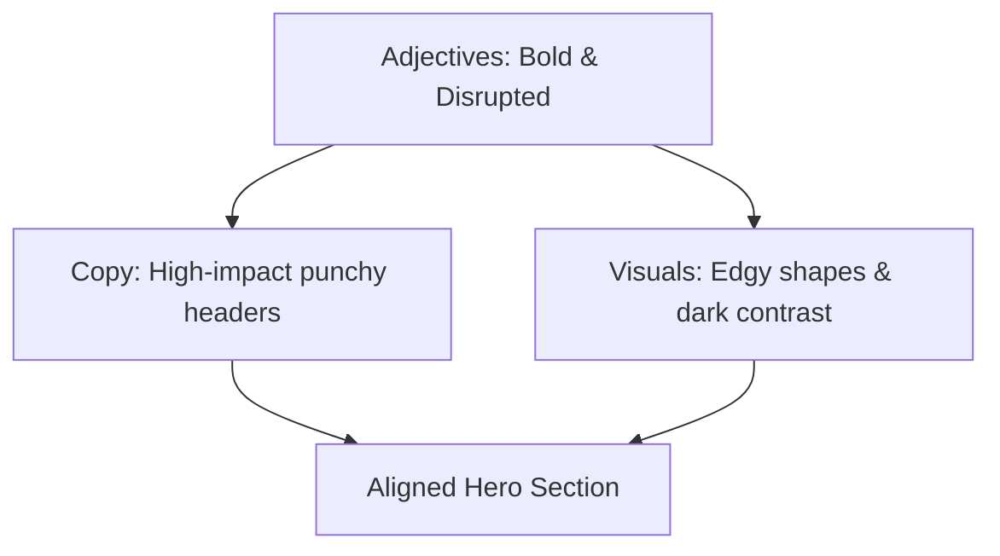

# Brand Identity Tutorials

This document provides step-by-step, learning-oriented lessons for constructing visual and
verbal brand identity frameworks. Follow these lessons to build a cohesive brand system from
the ground up.

---

## Tutorial 1: Designing a Visual Identity System

This tutorial guides you through the creation of a foundational visual identity system. By the
end of this lesson, you will have a defined visual vocabulary for your brand.

### Step 1: Establish a Brand Mood Board

Gathering visual inspiration helps translate abstract strategic values into concrete shapes,
colors, and layouts.

- **Select Platforms**: Use tools like Pinterest, Behance, or Dribbble to curate imagery.
- **Collect Samples**: Pin 20 to 30 images, including photography, interface layouts, typography
  specimens, patterns, and color samples.
- **Identify Themes**: Analyze the collection to locate repeating patterns, such as organic shapes,
  sharp lines, muted tones, or high-contrast interfaces.

### Step 2: Define the Color Palette

Develop a palette consisting of a primary brand color, secondary supporting colors, and neutral
background tones. Apply the **60-30-10 rule**:

- **60% Dominant Tone**: Typically a neutral color (light or dark mode background) that sets the
  overall canvas.
- **30% Secondary Brand Tone**: Used for structural elements, secondary buttons, and headers.
- **10% Accent Tone**: A high-contrast color used exclusively for primary calls to action (CTAs)
  and key focus points.

### Step 3: Establish Typography Rules

Choose a maximum of two font families to ensure layout clarity and fast digital rendering:

- **Heading Font**: A typeface that reflects the brand's personality (e.g., a classic serif for
  formality, or a geometric sans-serif for modern tech).
- **Body Font**: A highly legible sans-serif typeface optimized for readability at small sizes on
  various screen resolutions.
- **Scale Definition**: Document clear size and weight pairings (e.g., `h1` at 32px bold, body at
  16px regular).

### Step 4: Establish Logo Design Criteria

Draft a vector logo that scales cleanly across multiple digital and physical applications:

- **Keep it Simple**: Use simple geometric shapes and limit the design to one or two colors.
- **Responsive Variants**: Define a primary logo (wordmark and symbol combined), a secondary logo
  (horizontal layout), and a minimal icon (isotype) for favicons and small avatar frames.
- **Legibility Test**: Verify that the logo remains readable when scaled down to a 16x16 pixel grid.

---

## Tutorial 2: Creating a Verbal Identity Framework

This tutorial outlines the process for defining a brand's communication voice, messaging pillars,
and editorial standards.

### Step 1: Identify Brand Personality Adjectives

Determine the core traits of your brand's communication style:

- Select three primary adjectives that represent how your brand speaks (e.g., authoritative,
  innovative, trustworthy).
- Ensure these adjectives align directly with your overall brand strategy.

### Step 2: Formulate "This, but not That" Voice Principles

Create guardrails for your voice to prevent writers from drifting into extreme or inappropriate
styles:

- Take each personality adjective and define its positive limit.
- **Example Formulation**:
  - "We are _innovative_, but not _over-promising_."
  - "We are _authoritative_, but not _bland_."
  - "We are _playful_, but not _unprofessional_."

### Step 3: Draft the Core Strategic Statements

Write clear statements that describe what you do, where you are going, and why you exist:

- **Mission Statement**: Focus on the present value proposition. Define _what_ you do, _for whom_,
  and _how_.
- **Vision Statement**: Focus on the medium-term aspirational goal. Define the target future state
  to motivate teams.
- **Purpose Statement**: Focus on the deep reason for existence. Define the positive impact you
  aim to make on the industry or society.

### Step 4: Outline Brand Messaging Pillars

Define three core themes that structure all marketing and product communication:

- Identify the unique capabilities of your solution.
- For each capability, extract the direct benefit for the user.
- **Structure**: Create a short title, followed by a one-sentence user-facing promise.

---

## Tutorial 3: Aligning Visual and Verbal Identity

This tutorial details a practical exercise to align visual layouts with verbal messaging for a
website's hero section.

### Step 1: Define the Scenario

Imagine you are building a product page for a high-performance developer tool. The brand strategy
defines the personality as _bold_, _efficient_, and _technical_.

### Step 2: Draft the Verbal Assets

- **Headline**: Write a short, active-voice headline using rhetorical devices like tricolons
  (e.g., "Build. Test. Deploy.") or antithesis (e.g., "Zero config. Infinite scale.").
- **Sub-headline**: Keep it to two sentences. Focus on the core user benefit (e.g., "Automate your
  entire deployment pipeline without leaving your terminal.").
- **CTA Button**: Write action-focused copy (e.g., "Get started free").

### Step 3: Select Matching Visual Assets

- **Color Choice**: Use a dark mode background (60%), a neutral cool gray for secondary text
  (30%), and a vibrant neon green or electric blue accent (10%) for the CTA button.
- **Typography**: Apply a clean, monospace font for headlines to reinforce the technical theme, and
  a neutral geometric sans-serif for the body copy.
- **Imagery**: Feature a clean screenshot of the command-line interface or a simplified vector
  flow diagram instead of generic lifestyle stock photography.

### Step 4: Verification

Review the complete layout. If the copy is technical and direct, but the background uses soft pastel
pink circles and curly serif typography, the visual and verbal elements contradict each other. Replace
them with high-contrast, structured grid elements to restore coherence.
