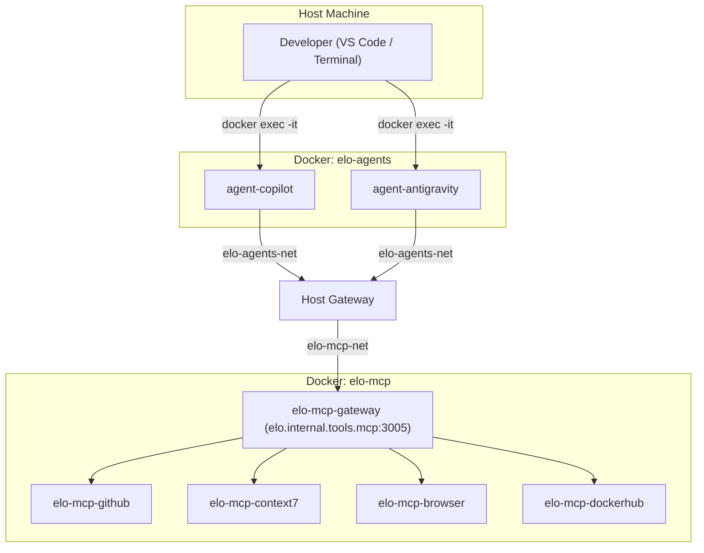

### Containerized AI Agents

The `tools/agents` workspace provisions GitHub Copilot and Google Antigravity CLIs as long-running Docker services. This eliminates manual CLI installations on developer host machines and guarantees environment parity between local workstations and cloud VMs.

#### Architecture Overview

The agent containers run inside the same `elo-mcp-net` bridge network as the MCP gateway, communicating with it via internal DNS routing. No host-level port exposure is required for inter-service communication.



#### Directory Layout

```
tools/agents/
├── .env.agents.example     # Environment variable template (tracked)
├── .env.agents             # Secrets (Git-ignored)
├── compose.yaml            # Orchestration for both agent containers
├── mcp_config.json         # Unified MCP config (injected into both containers)
├── skills/                 # Shared agent skills (injected into both containers)
│   ├── code-expert/
│   └── doc-expert/
├── copilot/
│   ├── Dockerfile          # GitHub CLI + Copilot CLI + Docker CLI
│   ├── data/               # Git-ignored: Copilot session state and auth tokens
│   └── gh-config/          # Git-ignored: GitHub CLI credentials and extensions
└── antigravity/
    ├── Dockerfile          # Antigravity CLI + Docker CLI
    ├── data/               # Git-ignored: conversations, brain, log buffers
    ├── settings.json       # Version-controlled TUI settings (container paths)
    ├── statusline.sh       # CLI status bar script
    └── title.sh            # CLI window title script
```

#### Configuration Injection Strategy

All configuration is injected via Docker bind mounts at container startup. No files are baked into the image layers, ensuring that settings changes take effect without rebuilding images.

| Mount Source                  | Container Destination                         | Purpose                            |
| :---------------------------- | :-------------------------------------------- | :--------------------------------- |
| `../../`                      | `/workspace`                                  | Full monorepo working directory    |
| `./skills/`                   | `/workspace/.agents/skills`                   | Shared skills visible to both CLIs |
| `./mcp_config.json`           | `/workspace/.agents/mcp_config.json`          | Unified MCP endpoint configuration |
| `./antigravity/data/`         | `/root/.gemini/antigravity-cli/`              | Persistent runtime data            |
| `./antigravity/settings.json` | `/root/.gemini/antigravity-cli/settings.json` | Version-controlled TUI settings    |
| `./copilot/data/`             | `/root/.copilot/`                             | Persistent Copilot session state   |
| `./copilot/gh-config/`        | `/root/.config/gh/`                           | Persistent GitHub CLI credentials  |
| `/var/run/docker.sock`        | `/var/run/docker.sock`                        | Docker-out-of-Docker orchestration |
| `~/.ssh`                      | `/root/.ssh` (read-only)                      | Host SSH keys for Git operations   |
| `~/.gitconfig`                | `/root/.gitconfig` (read-only)                | Host Git identity                  |

#### MCP Network Connectivity

Inside the agent containers, MCP services are resolved via the host gateway using the custom alias `elo.internal.tools.mcp` mapped to `host-gateway` on port `3005`. This allows the agent stack to start completely independently of the MCP stack.

```json
{
  "mcpServers": {
    "github": { "url": "http://elo.internal.tools.mcp:3005/github/sse" },
    "context7": { "url": "http://elo.internal.tools.mcp:3005/context7/sse" },
    "browser": { "url": "http://elo.internal.tools.mcp:3005/browser/sse" },
    "dockerhub": { "url": "http://elo.internal.tools.mcp:3005/dockerhub/sse" }
  }
}
```

:::info[Independent Boot Sequence]
The agent and MCP stacks are network-decoupled. Either stack can be started or stopped independently. The agents will automatically connect to the MCP gateway when the MCP stack is running.
:::

#### Lifecycle Commands

| Command                 | Action                                                                         |
| :---------------------- | :----------------------------------------------------------------------------- |
| `pnpm agents:up`        | Build images (if needed) and start both agent containers in detached mode.     |
| `pnpm agents:down`      | Stop and remove the agent containers.                                          |
| `pnpm agents:reset`     | Full teardown with volume removal followed by a clean rebuild and restart.     |
| `pnpm antigravity:auth` | Execute Google OAuth authentication flow in the active terminal window.        |
| `pnpm copilot:auth`     | Execute GitHub OAuth device authentication flow in the active terminal window. |

#### VS Code Task Integration

Agent CLIs are invoked via `docker exec` tasks registered in `.vscode/tasks.json`. Tasks are labeled with a `[Docker]` or `[Host]` prefix to distinguish containerized execution from host-level global installations.

| Task Label                 | Execution Target                        |
| :------------------------- | :-------------------------------------- |
| `[Docker] Antigravity CLI` | `docker exec -it agent-antigravity agy` |
| `[Docker] Copilot CLI`     | `docker exec -it agent-copilot copilot` |
| `[Host] Antigravity CLI`   | Host-global `agy` installation          |
| `[Host] Copilot CLI`       | Host-global `copilot` installation      |

#### Authentication and Session Persistence

Both CLIs use OAuth device-flow authentication. To authenticate the containerized agents, execute the direct authentication scripts (`pnpm copilot:auth` or `pnpm antigravity:auth`) in your active terminal. The CLI outputs a URL and a verification code. The developer opens the URL in the host browser, completes the authorization flow, and the resulting tokens are written to the container's home directory.

##### Persistent Storage & No-Rebuild Architecture

Because the credentials directories are bind-mounted to the host:

- `agent-copilot` mounts `./copilot/data/` to `/root/.copilot/` and `./copilot/gh-config/` to `/root/.config/gh/`
- `agent-antigravity` mounts `./antigravity/data/` to `/root/.gemini/antigravity-cli/`

Any authentication token generated during the first-time setup is directly written to these host directories in real time. As a result:

- **No container rebuild is required:** Rebuilding or restarting the container does not erase credentials, as the container reads tokens dynamically from the mounted host volumes.
- **Host Isolation:** While the container is authenticated, these credentials do not leak into the host user's global folders (e.g., `~/.gemini` or `~/.config/gh`), ensuring a clean separation between the container stack and host-global CLI installations.
- **Automated Synced Access:** As soon as the user completes the device authorization flow, the credentials immediately become active and functional. No manual file copies or restarts are necessary.

:::note
The `data/` and `gh-config/` directories are Git-ignored. They exist only on the developer's local machine and are never committed to the repository.
:::
