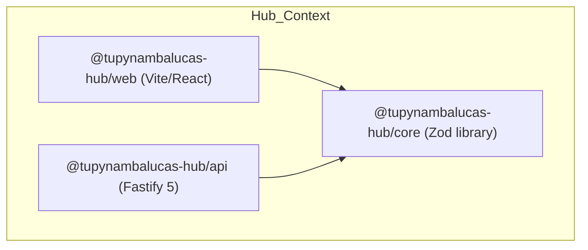

# Bounded Context: Developer Hub

This file defines the domain rules, local stack services, and workspace structure for the personal **Developer Hub Bounded Context** (`hub/`).

---

## Bounded Context Navigation

Before editing or analyzing code in this context, read the local rules for the specific workspace:

- **Core Library**: [packages/core/AGENTS.md](./packages/core/AGENTS.md) — Shared types, Zod schemas, and data validation rules.
- **REST API**: [services/api/AGENTS.md](./services/api/AGENTS.md) — Fastify 5 route definitions, Mongoose models, and Mapped Repository logic.
- **Web Client**: [services/web/AGENTS.md](./services/web/AGENTS.md) — React 19 visual client, Zustand state stores, and fluid CSS styling.
- **Workspace Documentation**: Refer to the developer website documentation in [docs/README.md](../docs/README.md).

---

## Bounded Context Architecture

The Hub context manages all personal developer website operations. It is architected for strict domain isolation and scalability.

- **Canonical Database**: The database connection parses Mongoose connection strings and dynamically overrides the database name to **`hubdb`** in all environments (development, staging, and production).
- **Integrated Seeding (`SeedPlugin`)**: The initial administrator user creation is natively integrated into the Fastify server lifecycle as an idempotent onReady plugin. Local compose scripts only initialize the replica set.
- **State & Action Segregation**: State management in the client strictly separates properties from actions in Zustand stores, exporting atomic selectors.

---

## Context Isolation Guardrails

1. **No Cross-Context Imports**: You MUST NEVER import modules, constants, validation schemas, or helper functions from other bounded contexts like `profile/`. All shared utilities or assets must be locally duplicated or centralized in global tooling workspaces if permitted.
2. **Catalog Integrity**: All dependencies must declare versions using workspace catalogs (`catalog:web-stack`, `catalog:api-stack`, `catalog:shared-stack`, etc.) defined in `pnpm-workspace.yaml`.

---

## Local Lifecycle Commands

Run these scripts from the monorepo root to manage the hub stack:

- `pnpm hub:dev`: Boots the local compose databases (MongoDB + Redis), builds `@tupynambalucas-hub/core`, and runs `@tupynambalucas-hub/api` and `@tupynambalucas-hub/web` concurrently.
- `pnpm hub:up`: Boots only the MongoDB replica set (`tupynambalucas-hub-db-dev`) and Redis (`tupynambalucas-hub-redis-dev`) containers.
- `pnpm hub:down`: Stops local Docker containers and releases localhost ports 3000 and 5173.
- `pnpm hub:reset`: Clears local database volumes and rebuilds developer infrastructure containers.
- `pnpm hub:prod`: Builds and launches the production stack (API + Web + Redis) using `.env.prod`.
- `pnpm hub:prod:down`: Stops and tears down the production stack.
- `pnpm hub:staging`: Builds and launches the staging stack using `.env.staging`.
- `pnpm hub:staging:down`: Stops and tears down the staging stack.
