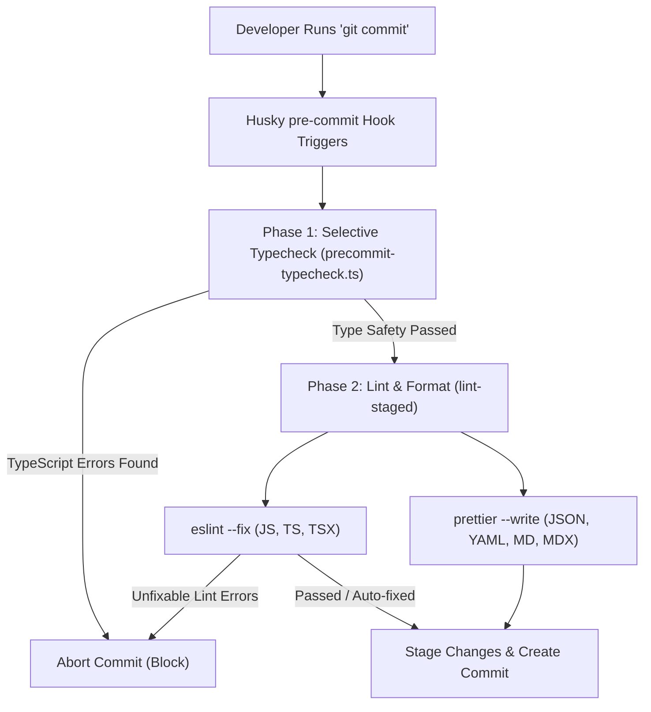

# Commit Conventions & CI

Para manter um histórico limpo e automatizado, todos os commits devem seguir a especificação **[Conventional Commits](https://www.conventionalcommits.org/)**.

**Format:** `\<type>(\<scope>): \<description>`

### Tipos

* **feat**: Um novo recurso (corresponde a `MINOR` no SemVer).
* **fix**: Uma correção de bug (corresponde a `PATCH` no SemVer).
* **docs**: Apenas alterações na documentação.
* **style**: Alterações que não afetam o significado do código (espaços em branco, formatação, etc.).
* **refactor**: Uma alteração de código que não corrige um bug nem adiciona um recurso.
* **perf**: Uma alteração de código que melhora o desempenho.
* **test**: Adição de testes faltantes ou correção de testes existentes.
* **chore**: Alterações no processo de build ou em ferramentas/bibliotecas auxiliares.

### Monorepo Scopes

Use o contexto ou nome do pacote como escopo:

* **`hub`**: Alterações nos aplicativos, na API ou no núcleo do Developer Hub.
* **`cortex`**: Alterações no gateway de entrada de IA, camada de memória, adaptadores MCP ou agentes.
* **`studio`**: Design tokens, ativos ou configuração do Penpot.
* **`tools`**: Automação do Git e da CLI do GitHub.
* **`deps`**: Atualizações de dependências (gerenciadas via catálogos).

**Example:** `feat(hub): add Pix payment reconciliation to checkout`

---

## Commit Validation & CI Hooks

Para manter a qualidade do código, a consistência de estilo e a segurança de tipos em todo o monorepo **%PROJECT_DOMAIN%**, usamos uma pipeline automatizada que verifica todas as alterações antes de serem commitadas localmente e antes de serem mescladas na nuvem.

### Local Validation Architecture (Pre-commit)

Quando você executa o comando `git commit`, o Git intercepta automaticamente a ação e executa uma pipeline de validação local. Se qualquer etapa nesta pipeline falhar, o commit é bloqueado.

A validação local é executada em duas fases sequenciais:



---

### Selective Workspace Typechecking

Executar uma verificação de tipos completa em todos os pacotes do monorepo (`pnpm typecheck`) pode levar vários segundos. Para manter o processo de commit rápido, usamos um script personalizado localizado em [precommit-typecheck.ts](file:///D:/projects/workspace/tools/scripts/precommit-typecheck.ts).

#### Como funciona

1. O script inspeciona os arquivos atualmente preparados (staged) usando `git diff --cached --name-only`.
2. Ele detecta as extensões de arquivo: se nenhum arquivo JavaScript ou TypeScript foi alterado, ele ignora a verificação de tipos completamente.
3. Ele mapeia os arquivos alterados para seus respectivos workspaces do monorepo:
   * Arquivos em `hub/` $\rightarrow$ verificam os tipos dos pacotes `@repo/hub/*`.
   * Arquivos em `cortex/` $\rightarrow$ verificam os tipos de `@/cortex`.
   * Arquivos em `studio/` $\rightarrow$ verificam os tipos de `@repo/studio/assets`.
   * Arquivos em `tools/` $\rightarrow$ verificam os tipos de `@repo/tools/*`.
   * Arquivos em `docs/` $\rightarrow$ verificam os tipos de `@/docs`.
4. Se a configuração global ou arquivos raiz (por exemplo, `package.json`, `eslint.config.ts`, `pnpm-workspace.yaml`) forem modificados, o script executa uma verificação de tipos completa.
5. Ele executa a verificação de tipos direcionada em paralelo usando filtros do Turborepo (por exemplo, `npx turbo run typecheck --filter=@repo/hub/*`).

:::tip[Vantagem de desempenho]
Se você modificar apenas arquivos no workspace `cortex`, apenas o projeto cortex terá seus tipos verificados, o que leva menos de 1,5 segundo. Se você modificar apenas a documentação (arquivos `.md` ou `.mdx`), a verificação de tipos é ignorada inteiramente.
:::

---

### Linting and Formatting (lint-staged)

Assim que a verificação de tipos for aprovada, o Husky aciona o `lint-staged`, que executa linters e formatadores apenas nos arquivos preparados (staged).

#### Configuração

As regras são declaradas no [package.json](file:///D:/projects/workspace/package.json) raiz:

```json
  "lint-staged": {
    "**/*.{js,mjs,ts,tsx,mdx}": [
      "eslint --fix"
    ],
    "**/*.{json,yaml,md,css,html}": [
      "prettier --write"
    ]
  }
```

:::note[Integração com o Prettier]
Para arquivos JavaScript, TypeScript e TSX, não executamos a CLI independente do Prettier. Em vez disso, o Prettier é executado como uma regra do ESLint por meio do `eslint-plugin-prettier`. Executar `eslint --fix` formata o código de acordo com [shared/config/prettierrc.json](file:///D:/projects/workspace/shared/config/prettierrc.json) e verifica problemas de qualidade de código em uma única execução.
:::

---

### Remote Validation (GitHub Actions CI)

Os ganchos locais do Git podem ser ignorados (por exemplo, usando `git commit --no-verify`). Para evitar que código não validado chegue a branches estáveis, executamos um workflow de Integração Contínua (CI) no GitHub a cada push e Pull Request.

A configuração do workflow é definida em [.github/workflows/ci.yaml](file:///D:/projects/workspace/.github/workflows/ci.yaml):

* Ele instala as dependências usando `pnpm install --frozen-lockfile`.
* Ele executa o conjunto completo de verificação de tipos: `pnpm typecheck --filter=!@repo/hub/*`.
* Ele valida o estilo e a qualidade do código: `pnpm lint --filter=!@repo/hub/*`.

:::caution[Proteção de branch]
Os administradores do repositório devem configurar regras de proteção de branch no GitHub para os branches `main` e `develop`. Habilite a opção **Require status checks to pass before merging** e selecione **Validate Types & Lint** para evitar a mesclagem de PRs com falhas no build.
:::

---

Para manter nossas pipelines de CI/CD altamente sustentáveis e eficientes, aplicamos as seguintes regras arquiteturais para todos os workflows do repositório:

* **Módulos de CI Reutilizáveis**: Os workflows em `.github/workflows/` não devem duplicar a lógica de configuração do ambiente. Comportamentos compartilhados (como execução de node, instalações do PNPM e configurações de cache) são extraídos para **Ações Compostas do GitHub** independentes em `.github/actions/`.

---

### Componente de CI Reutilizável: `.github/actions/setup-pnpm-env/action.yml` (SRP)

Em vez de duplicar configurações de dependências em workflows do GitHub, extraia-as para uma ação composta:

```yaml
name: 'Setup PNPM Environment'
description: 'Installs Node, PNPM, and configures dependency caching'

inputs:
  node-version:
    description: 'Node.js version to use'
    required: false
    default: '22'

runs:
  using: 'composite'
  steps:
    - name: Checkout Repository
      uses: actions/checkout@v6
      with:
        fetch-depth: 0

    - name: Install pnpm
      uses: pnpm/action-setup@v6

    - name: Setup Node
      uses: actions/setup-node@v6
      with:
        node-version: ${{ inputs.node-version }}
        cache: 'pnpm'

    - name: Install Dependencies
      shell: bash
      run: pnpm install
```

### Decoupled Script Contract: `sync_repo_secrets_variables.sh` (DIP)

Este script depende estritamente de parâmetros injetados pelo ambiente, abstraindo completamente os caminhos físicos do disco na máquina do runner:

```bash
#!/usr/bin/env bash

set -euo pipefail

log_info() {
  echo "[GH-CLI INFO] $(date '+%Y-%m-%d %H:%M:%S') - $1"
}

log_error() {
  echo "[GH-CLI ERROR] $(date '+%Y-%m-%d %H:%M:%S') - $1" >&2
}

# Verify dependencies are injected via the environment
if [[ -z "${SECRETS_DIR:-}" ]]; then
  log_error "Required environment variable SECRETS_DIR is undefined."
  exit 1
fi

if [[ -z "${VARIABLES_FILE:-}" ]]; then
  log_error "Required environment variable VARIABLES_FILE is undefined."
  exit 1
fi

log_info "Reading variables from: $VARIABLES_FILE"
log_info "Scanning secrets directory: $SECRETS_DIR"

if [[ ! -f "$VARIABLES_FILE" ]]; then
  log_error "Variables file not found at: $VARIABLES_FILE"
  exit 1
fi

log_info "Synchronization completed successfully."
```

### Decoupled Orchestrator: `compose.yaml` (DIP & ISP)

O orquestrador mapeia arquivos concretos para os alvos abstratos exigidos pelo limite do container e injeta variáveis de nível de host carregadas automaticamente a partir de `.env`:

```yaml
services:
  gh-secrets:
    build:
      context: ../../services/gh
      dockerfile: Dockerfile
    container_name: github-gh-secrets
    volumes:
      - ../../:/workspace
    env_file:
      - ../../services/gh/.env.gh
    environment:
      - GH_TOKEN=${GH_TOKEN}
    working_dir: /workspace
    command: ['/workspace/services/gh/src/sync_repo_secrets_variables.sh']
```

---

:::tip[Benefícios de extensibilidade]
Sob esse layout, adicionar um novo container de ferramentas (por exemplo, `sentry-uploader` ou `sonar-scanner`) é tão simples quanto adicionar um diretório em `services/`, estabelecer seus requisitos de `.env` e registrá-lo em `/infrastructure/docker/compose.yaml`. As ações principais, os workflows e os diretórios de configuração existentes permanecem bloqueados e completamente seguros.
:::

---

*A adesão a este workflow garante um histórico limpo e distribuição de software de alta qualidade.*
