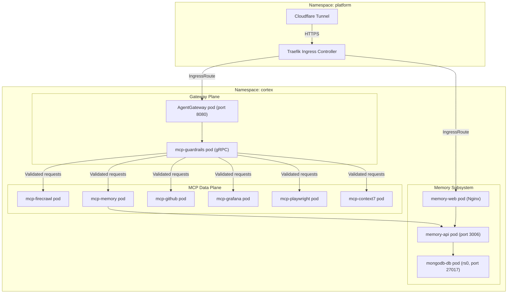

O Workspace Cortex consolida todas as operações de inteligência artificial em um Bounded Context unificado. Ao co-localizar o API Ingress Gateway, a camada de memória persistente, o plano de dados do Model Context Protocol (MCP) e os workspaces de agentes conteinerizados sob um único namespace do Kubernetes, o sistema garante previsibilidade de ambiente, isolamento de rede e segurança.

---

## 1. Topologia de Rede e Isolamento

Todos os serviços do Cortex são executados dentro do namespace `cortex` do Kubernetes. O tráfego de entrada entra através do Traefik (implantado no namespace `platform`) e é roteado através do AgentGateway antes de alcançar qualquer pod MCP downstream ou o subsistema de memória.



### Modelo de Isolamento

* Toda a comunicação entre serviços usa nomes DNS do Kubernetes (por exemplo, `memory-api:3006`, `agentgateway:8080`). Nenhum serviço expõe uma NodePort diretamente para o host, exceto durante sessões locais de desenvolvimento com o Skaffold.
* Os pods MCP downstream e os pods do Subsistema de Memória só são alcançáveis por meio do AgentGateway ou das IngressRoutes do Traefik. Nenhum acesso direto de pod para pod a partir de containers de agentes é permitido.
* O namespace `platform` hospeda o Traefik, o OpenTelemetry Collector e a pilha do Grafana. Os dados de telemetria fluem dos pods do Cortex para o namespace platform via OTLP.

---

## 2. Estrutura de Diretórios

```text
cortex/
 gateway/                 # AgentGateway configuration (config.yaml, guardrails)
 mcp/
    guardrails/          # gRPC ExtMCP policy processor
    inspector/           # MCP Inspector web UI (dev only)
    services/            # Downstream MCP adapter packages
        context7/
        firecrawl/
        github/
        grafana/
        memory/
        playwright/
 memory/
    packages/core/       # Shared TypeScript models and Zod schemas
    services/
        api/             # memory-api Fastify backend
        mongodb/         # MongoDB 7.0 rs0 init scripts
        web/             # memory-web React dashboard
 infrastructure/
    kubernetes/          # Skaffold + Kustomize manifests
        base/            # Base Kustomize resources
        overlays/        # dev / staging / prod overlays
 package.json
 AGENTS.md
```

---

## 3. Roteamento de Ingress e Federação de Ferramentas

O **AgentGateway** é o único ponto de entrada para todas as chamadas de ferramentas de IA. Ele valida, enriquece e roteia requisições através do seguinte pipeline:

1. **Cloudflare Tunnel -> Traefik**: O tráfego HTTPS público entra através de um Cloudflare Tunnel que termina no Traefik Ingress Controller no namespace `platform`.
2. **Traefik -> AgentGateway**: Uma IngressRoute encaminha o tráfego da API do agente para o pod do AgentGateway na porta `8080`.
3. **ExtMCP Guardrails**: O AgentGateway delega cada requisição `tools/call` para o sidecar gRPC `mcp-guardrails`, que:
   * Percorre recursivamente os argumentos da ferramenta e reescreve strings `localhost` / `127.0.0.1` para `host.docker.internal` como um proxy de rede transparente.
   * Retorna `{ pass: {} }` em qualquer exceção de parsing (contrato fail-open).
4. **Despacho Downstream**: Requisições validadas são encaminhadas para o pod de adaptador MCP apropriado (por exemplo, `mcp-firecrawl`, `mcp-memory`) via DNS de serviço do Kubernetes.

### Configuração de Ferramentas em Containers de Agentes

Os containers de agentes referenciam o AgentGateway como o único endpoint MCP:

```json
{
  "mcpServers": {
    "cortex": { "url": "http://agentgateway:8080/mcp" }
  }
}
```

O AgentGateway federada a requisição para o pod MCP downstream correto de forma transparente. Os agentes não precisam de URLs de serviços individuais.
