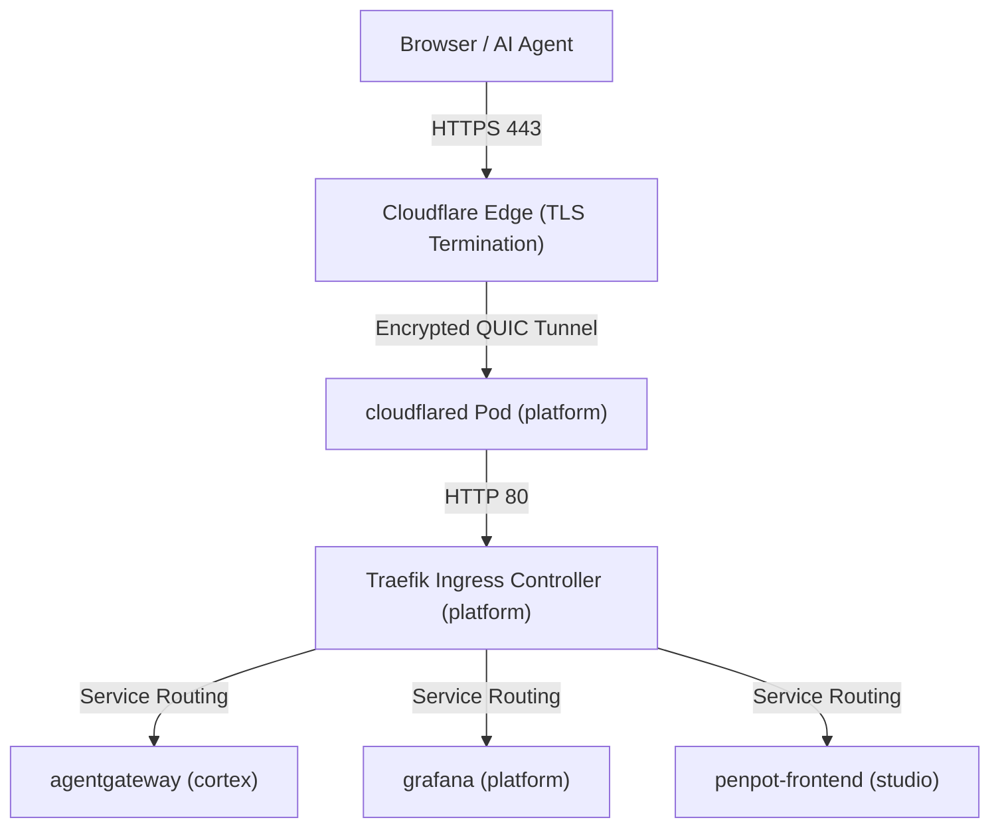

# Arquitetura de Infraestrutura

O %PROJECT_DOMAIN% utiliza um pipeline de orquestração nativo do Kubernetes e uma arquitetura de proxy reverso edge-to-cluster para gerenciar terminação TLS, segurança Zero Trust e roteamento de requisições entre contextos delimitados.

---

## 1. Layout de Manifestos do Kubernetes

Workspaces que oferecem suporte a deploy no Kubernetes utilizam um layout de diretórios baseado em Kustomize que espelha sua estrutura em camadas. Todas as configurações residem dentro do contexto delimitado centralizado de `infrastructure`.

* **Esquema de Caminho**:
  * `infrastructure/environments/\<env>/\<context>` (Overlays do Kustomize)
  * `infrastructure/manifests/\<context>.yaml` (Deployments + Services + Ingress)
* **Aplicação**: Usado universalmente em todos os contextos (`platform`, `cortex`, `studio`).

---

## 2. Proxy Reverso e Roteamento de Requisições

Utilizamos uma arquitetura de proxy reverso edge-to-cluster para gerenciar o roteamento de requisições públicas e internas.

### 2.1. Cloudflare Tunnel e Topologia Edge

O acesso público a ambientes de desenvolvimento Kubernetes locais e remotos é fornecido via **Cloudflare Tunnel** (`cloudflared`) integrado ao **Cloudflare Zero Trust**:

* **Terminação TLS no Edge:** O Cloudflare Edge termina o HTTPS público para `*-dev.%PROJECT_DOMAIN%` utilizando certificados SSL/TLS coringa de nível único (`*.%PROJECT_DOMAIN%`).
* **Transporte de Túnel Criptografado:** O tráfego trafega do Cloudflare Edge para o cluster através de uma conexão QUIC criptografada gerenciada pelo deploy do `cloudflared` no namespace `platform`.
* **Traefik Ingress Controller:** O `cloudflared` encaminha as requisições internamente para o Traefik na porta 80 (`http://traefik.platform.svc.cluster.local:80`), que roteia payloads HTTP/gRPC para os Services de destino com base em recursos `Ingress` padrão do Kubernetes.

### 2.2. Esquema de Domínio de Desenvolvimento Autoritativo

Todos os serviços de desenvolvimento adotam uma estrutura de subdomínio hifenizada de nível único (`*-dev.%PROJECT_DOMAIN%`) para garantir 100% de compatibilidade com certificados SSL universais gratuitos:

| Host do Domínio                         | Service de Destino     | Namespace  | Propósito                                         |
| :-------------------------------------- | :--------------------- | :--------- | :------------------------------------------------ |
| `agentgateway-dev.%PROJECT_DOMAIN%`     | `agentgateway:15000`   | `cortex`   | UI Administrativa e Control Plane do AgentGateway |
| `agentgateway-mcp-dev.%PROJECT_DOMAIN%` | `agentgateway:8080`    | `cortex`   | Endpoint Ingress MCP Direto (`/mcp`)              |
| `grafana-dev.%PROJECT_DOMAIN%`          | `grafana:3000`         | `platform` | Dashboard de Observabilidade do Grafana           |
| `headlamp-dev.%PROJECT_DOMAIN%`         | `headlamp:80`          | `platform` | Dashboard do Kubernetes Headlamp                  |
| `traefik-dev.%PROJECT_DOMAIN%`          | `traefik:8082`         | `platform` | Dashboard do Ingress Traefik                      |
| `penpot-dev.%PROJECT_DOMAIN%`           | `penpot-frontend:8080` | `studio`   | Ferramenta de Design Penpot                       |
| `memos-dev.%PROJECT_DOMAIN%`            | `memos:5230`           | `studio`   | Aplicativo de Notas Memos                         |
| `docs.%PROJECT_DOMAIN%`                 | Cloudflare Pages       | Externo    | Central de Documentação Técnica do Docusaurus     |

### 2.3. Cloudflare Access e Políticas de Zero Trust

Para proteger os endpoints de desenvolvimento expostos via Cloudflare Tunnel:

* **Web Dashboards (Grafana, Headlamp, Traefik, AgentGateway Admin):** Protegidos por políticas de **E-mail / One-Time PIN (OTP)** do Cloudflare Access. Apenas endereços de e-mail de desenvolvedores autorizados recebem PINs de autenticação.
* **Endpoints de IA e MCP (`agentgateway-mcp-dev.%PROJECT_DOMAIN%`):** Configurados com uma política de **Bypass** ou autenticação por Service Token no Cloudflare Zero Trust com roteamento de túnel direcionado para `/mcp`. Isso permite que clientes que não são browsers (como agentes de IA, ferramentas de CLI e pipelines automatizados) troquem payloads JSON-RPC / SSE sem encontrar redirecionamentos interativos de login do browser.
