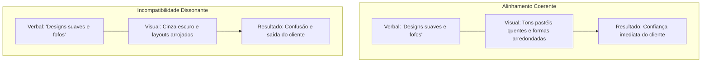

# Explicação da Identidade de Marca

Este documento aborda o embasamento teórico, o alinhamento arquitetural e os princípios psicológicos do design de identidade visual e verbal da marca.

---

## 1. A Anatomia de uma Marca: Identidade Interna vs. Externa

A compreensão da arquitetura de marca exige a separação da identidade estratégica interna dos elementos de identidade externa.

* **Identidade de Marca (A Personalidade)**:
  Isto representa o núcleo estratégico da organização. É a personalidade interna, a missão,
  a visão, os valores e a conexão emocional que uma empresa mantém com o seu público-alvo. É
  análoga ao caráter, às crenças e aos padrões de fala de uma pessoa.
* **Identidade Visual (A Apresentação)**:
  Esta é a expressão externa do núcleo da marca. Consiste em cores, formas, tipografia, layouts
  e imagens. É análoga ao estilo de vestimenta, cabelo, postura e aparência visual de uma pessoa.

A identidade visual não pode operar de forma isolada. As decisões de design devem ser impulsionadas pela
estratégia de marca; caso contrário, os elementos visuais correm o risco de parecer arbitrários ou modistas, perdendo
seu significado ao longo do tempo.

---

## 2. Coerência Cognitiva: A Psicologia do Alinhamento

O sucesso de uma marca depende fortemente da coerência cognitiva — o alinhamento de todas as entradas sensoriais.
Quando a identidade visual de uma marca corresponde à sua identidade verbal, ela reforça a mensagem e constrói
a confiança do cliente.

### O Custo da Dissonância Cognitiva

Se a mensagem verbal de uma marca contradiz o seu estilo visual, isso desencadeia dissonância cognitiva
no cérebro do usuário.

* **Exemplo Incompatível**: Considere uma startup de roupas infantis. Se o seu texto utiliza uma linguagem suave
  e reconfortante descrevendo fibras naturais e cortes fofos, mas o seu site apresenta layouts em carvão escuro,
  formas geométricas vetoriais arrojadas e fotografia preto e branco severa, o cérebro do cliente
  experimenta atrito.
* **O Resultado**: O cliente sente uma sensação de mal-estar, tem dificuldades para processar os benefícios do produto
  e abandona a página. Para startups de tecnologia, essa incompatibilidade geralmente assume a forma de "tech-speak" complexo
  emparelhado com ilustrações excessivamente lúdicas, o que dilui a percepção de confiabilidade corporativa.

---

## 3. Estratégia de Marca como a Fundação

Toda decisão de branding deve originar-se da estratégia de marca. Um exercício padrão de estratégia
estabelece:

1. **Mercado-Alvo**: Os dados demográficos e psicográficos do cliente ideal.
2. **Cenário Competitivo**: Lacunas na mensagem dos concorrentes que permitem a diferenciação.
3. **Arquétipo Central da Marca**: O arquétipo de personagem (por exemplo, Criador, Rebelde, Aliado, Sábio) que define a
   voz e a estética.

Sem essa base estratégica, os designers são forçados a depender de tendências. As tendências têm vida curta
e levam a reformulações de marca frequentes que confundem os clientes e diluem o valor da marca.

---

## 4. Equilibrando Consistência e Flexibilidade

Uma armadilha comum é assumir que uma identidade de marca forte exige que tudo pareça e soe
identico em todas as plataformas. Um sistema de identidade robusto deve equilibrar a consistência com a flexibilidade.

* **Consistência (A Âncora)**:
  A consistência garante que o caráter central da marca seja instantaneamente reconhecível em cada ponto de contato.
  Um usuário que encontre a marca em um feed do Instagram, em uma notificação de e-mail do sistema ou em uma embalagem física
  de produto deve reconhecer a mesma personalidade subjacente.
* **Flexibilidade (A Variável)**:
  A flexibilidade permite que o design e o texto se adaptem às restrições de diferentes canais. Por
  exemplo:
  * *Mídias Sociais (Instagram/TikTok)*: O tom pode mudar em direção à ludicidade e à estética visual.
  * *Alertas do Sistema (Uptime/Segurança)*: O tom deve mudar para uma clareza técnica concisa e séria.
  * *Botões de IU/Microcopy*: O espaço visual é limitado, exigindo textos curtos em sentence-case e cores de destaque de alto
    contraste.

---

## 5. Armadilhas Comuns no Desenvolvimento de Marca

* **Projetar Antes de Estrategizar**:
  Mergulhar no design de logotipos e grades de layout antes de definir a missão central e o público leva a
  sistemas visuais genéricos que falham em se conectar com os usuários.
* **Dependência de Jargão**:
  Startups de tecnologia frequentemente dependem de jargões da indústria (por exemplo, "sinergia", "next-gen", "mudança de paradigma"). Isso
  oculta os benefícios reais do produto e aliena partes interessadas não técnicas.
* **Perseguir Tendências de Design**:
  Adotar tendências de estilo (por exemplo, fundos com hiper-gradientes ou wordmarks minimalistas) faz com que uma marca pareça
  idêntica aos seus concorrentes e leva à obsolescência visual rápida.
* **Ignorar Restrições do Mundo Real**:
  Designs/layouts visuais que parecem bonitos em monitores de desktop de alta qualidade, mas falham em renderizar claramente em
  telas móveis de baixo contraste ou quando impressos em materiais físicos, resultam em uma experiência de usuário ruim.
