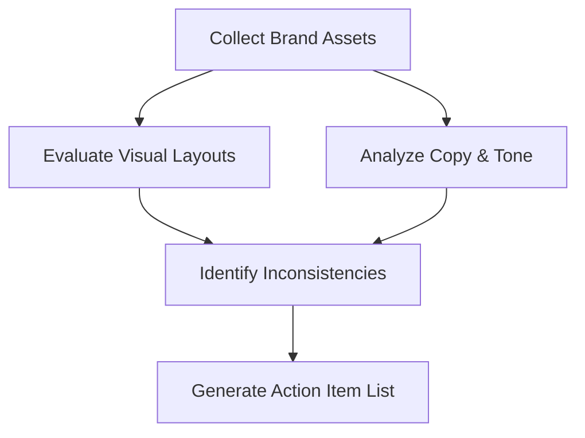

# Guia Prático de Identidade de Marca

Este documento fornece guias práticos e orientados a objetivos, passo a passo, para resolver tarefas específicas de implementação e manutenção de identidade de marca.

---

## Como Documentar um Guia de Estilo de Marca

Um guia de estilo de marca garante que colaboradores externos e equipes internas apliquem os elementos da marca de forma consistente. Use este processo para criar e documentar um guia.

### Passo 1: Criar a Estrutura do Documento

Organize seu guia de estilo de marca em quatro seções lógicas:

1. **Núcleo Estratégico**: Missão, visão, propósito e traços de personalidade.
2. **Identidade Verbal**: Princípios de tom de voz, pilares de mensagens e gramática da marca.
3. **Identidade Visual**: Uso do logotipo, especificações de cores, hierarquia tipográfica e regras de imagens.
4. **Diretório de Ativos**: Links para arquivos vetoriais oficiais, modelos e pacotes de fontes.

### Passo 2: Definir Restrições do Logotipo

Documente regras claras para evitar a distorção do seu logotipo. Inclua exemplos mostrando:

* **Espaço Livre Mínimo**: Defina o espaçamento ao redor do logotipo usando uma unidade relativa (por exemplo, "metade da altura do ícone do logotipo").
* **Modificações Proibidas**: Mostre exemplos visuais de uso incorreto, como esticar, rotacionar, alterar cores fora da paleta oficial ou posicionar o logotipo em fundos complexos de baixo contraste.
* **Limites de Tamanho Mínimo**: Especifique o menor tamanho em que o logotipo pode ser impresso ou exibido em telas.

### Passo 3: Especificar Valores Técnicos de Cores

Para cada cor na sua paleta de marca, documente os códigos de cores exatos para diferentes formatos de mídia:

* **Códigos HEX**: Para desenvolvimento web e arquivos CSS (por exemplo, `#0F172A`).
* **Valores RGB**: Para exibições em telas digitais e produção de vídeo.
* **Valores CMYK**: Para materiais impressos comerciais padrão.
* **Pantone (PMS)**: Para correspondência precisa de cores em embalagens profissionais e sinalização física.

---

## Como Estabelecer um Guia de Gramática de Marca

Um guia de Gramática da Marca define regras de linguagem técnica para garantir que a escrita permaneça consistente em todas as interfaces de produto e canais de marketing.

### Passo 1: Escolher uma Base de Inglês Regional

Padronize em um único dicionário regional e manual de estilo, dependendo do seu mercado-alvo principal:

* **Inglês Americano (EUA)**: Adote por padrão o AP Stylebook ou Chicago Manual of Style. Use grafias como *optimize*, *color* e *modeling*.
* **Inglês Britânico (UK)**: Adote por padrão o Oxford Style Manual. Use grafias como *optimise*, *colour* e *modelling*.

### Passo 2: Estabelecer Regras de Capitalização para Cabeçalhos

Defina regras de capitalização padrão para títulos, botões e textos de sistema para manter a consistência visual:

* **Title Case**: Capitalize a primeira letra da maioria das palavras (por exemplo, "The Complete Guide to Brand Design"). Use isso para títulos principais de landing pages e cabeçalhos de blog.
* **Sentence Case**: Capitalize apenas a primeira palavra (por exemplo, "Get started with your integration"). Use isso para parágrafos de descrição, campos de entrada e rótulos de botões.

### Passo 3: Definir o Uso de Contrações e Pronomes

Selecione sua postura em relação a contrações com base no nível de formalidade desejado:

* **Tom Conversacional**: Use contrações (*we're*, *it's*, *you'll*) e pronomes de tratamento direto (*you*, *our*) para soar amigável e acessível.
* **Tom Formal**: Evite contrações (*we are*, *it is*, *you will*) e use pronomes neutros para manter uma distância profissional.

---

## Como Conduzir uma Auditoria de Identidade de Marca

Execute uma auditoria de identidade semestralmente para identificar e corrigir inconsistências visuais e desvios no tom verbal.

### Passo 1: Compilar Ativos de Marca entre Canais

Colete capturas de tela de ativos e amostras de texto de todos os canais ativos voltados para o cliente:

* Páginas iniciais e landing pages de sites.
* Telas de interface de aplicativos para desktop e dispositivos móveis.
* Perfis de mídias sociais e feeds de publicações.
* E-mails automatizados do sistema e modelos de chat de suporte ao cliente.

### Passo 2: Auditar Conformidade Visual

Compare os ativos coletados com o Guia de Estilo de Marca oficial:

* Verifique se apenas arquivos e variantes oficiais de logotipo estão em uso.
* Teste a consistência de cores verificando os valores hexadecimais em CSS em relação às diretrizes da marca.
* Analise em busca de fontes em desacordo com as diretrizes e problemas de alinhamento de layout.

### Passo 3: Auditar Alinhamento Verbal

Analise amostras de texto para verificar desvios de tom:

* Avalie se o texto está alinhado com os adjetivos de personalidade de marca definidos.
* Verifique se o texto do sistema e as notificações cumprem as diretrizes de Gramática da Marca (por exemplo, capitalização correta, regras de contração).
* Identifique e sinalize jargões, clichês ou frases excessivamente informais.

### Passo 4: Gerar a Lista de Pendências de Remediação

Consolide todas as descobertas em uma lista de problemas priorizada. Agrupe os problemas por gravidade (por exemplo, cores incompatíveis críticas em páginas de preços, problemas de tamanho de fonte de baixa prioridade em arquivos de blog) e atribua-os às listas de pendências de design e desenvolvimento.

---

## Como Adaptar Visuais e Textos para Extensões de Produtos

Ao lançar novas linhas de produtos, use este workflow para estender seu sistema de identidade visual e verbal sem quebrar o reconhecimento da marca principal.

### Passo 1: Identificar Significadores Centrais da Marca (Âncoras Visuais)

Isole os elementos visual que devem permanecer idênticos em todas as linhas de produtos para preservar o reconhecimento da marca principal:

* **Tipografia**: Mantenha as combinações de fontes primária e secundária consistentes.
* **Sistema de Layout**: Mantenha os mesmos grades de espaçamento, estruturas de cartões e proporções de espaço livre visual.
* **Marca da Marca**: Sempre exiba o logotipo principal ou o ícone da marca em uma posição fixa (por exemplo, cabeçalho superior esquerdo).

### Passo 2: Definir Significadores de Extensão (Variáveis Visuais)

Selecione elementos visuais que possam ser personalizados para diferenciar a nova linha de produtos:

* **Cor de Destaque**: Introduza uma nova cor de destaque para representar a extensão (por exemplo, a Klarna usando rosa para finanças do consumidor, ao mesmo tempo em que introduz tons secundários para páginas de parceiros comerciais).
* **Imagens Secundárias**: Projete padrões distintos ou ativos de ilustração especificamente para o tópico do novo produto, mantendo o mesmo peso de estilo e traços de pincel.

### Passo 3: Alinhar e Ajustar o Tom do Texto

Ajuste a identidade verbal para se adequar ao público-alvo específico do novo produto, mantendo os princípios centrais de voz:

* **Manter a Voz**: Mantenha os traços de voz subjacentes consistentes (por exemplo, claros, autênticos).
* **Ajustar o Registro**: Ajuste o nível de formalidade dependendo do contexto. Por exemplo, uma marca que vende óleo de pimenta artesanal (por exemplo, Himalayan Harvest) deve manter seu tom terroso, mas pode usar uma linguagem culinária mais rica ao introduzir uma linha de cobertura de mel doce, mantendo intactas as estruturas de frases simples.
* **Manter a Gramática**: Não modifique as regras básicas da marca, como padrões de ortografia regional EUA/Reino Unido, estilos de capitalização ou uso de contrações.
