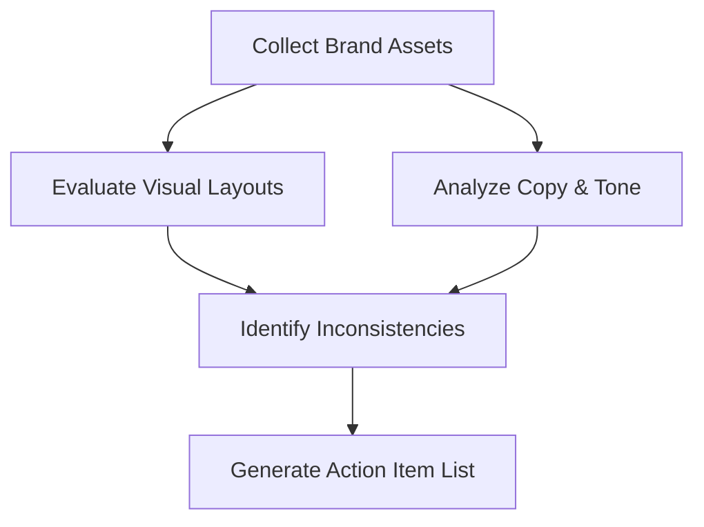

# Guias Práticos de Identidade de Marca

Este documento fornece guias práticos, orientados a objetivos e passo a passo para resolver tarefas específicas de implementação e manutenção da identidade da marca.

---

## Como Documentar um Guia de Estilo de Marca

Um guia de estilo de marca garante que colaboradores externos e equipes internas apliquem os elementos da marca de forma consistente. Utilize este processo para criar e documentar um guia.

### Passo 1: Criar a Estrutura do Documento

Organize seu guia de estilo de marca em quatro seções lógicas:

1. **Núcleo Estratégico**: Missão, visão, propósito e traços de personalidade.
2. **Identidade Verbal**: Princípios de tom de voz, pilares de mensagens e gramática da marca.
3. **Identidade Visual**: Uso do logotipo, especificações de cores, hierarquia tipográfica e regras de imagens.
4. **Diretório de Ativos**: Links para arquivos vetoriais oficiais, modelos e pacotes de fontes.

### Passo 2: Definir Restrições do Logotipo

Documente regras claras para evitar a distorção do seu logotipo. Inclua exemplos que mostrem:

* **Espaço Livre Mínimo**: Defina o preenchimento ao redor do logotipo usando uma unidade relativa (por exemplo, "metade da altura do ícone do logotipo").
* **Modificações Proibidas**: Mostre exemplos visuais de uso incorreto, como esticar, rotacionar, alterar cores fora da paleta oficial ou colocar o logotipo em fundos complexos de baixo contraste.
* **Limites de Tamanho Mínimo**: Especifique o menor tamanho no qual o logotipo pode ser impresso ou exibido em telas.

### Passo 3: Especificar Valores Técnicos de Cores

Para cada cor na sua paleta de marca, documente os códigos de cores exatos para diferentes formatos de mídia:

* **Códigos HEX**: Para desenvolvimento web e arquivos CSS (por exemplo, `#0F172A`).
* **Valores RGB**: Para exibições em telas digitais e produção de vídeo.
* **Valores CMYK**: Para materiais impressos comerciais padrão.
* **Pantone (PMS)**: Para correspondência precisa de cores em embalagens profissionais e sinalização física.

---

## Como Estabelecer um Guia de Gramática da Marca

Um guia de Gramática da Marca define regras de linguagem técnica para garantir que a escrita permaneça consistente em todas as interfaces de produtos e canais de marketing.

### Passo 1: Escolher uma Fundação de Inglês Regional

Padronize em um único dicionário regional e manual de estilo, dependendo do seu mercado-alvo principal:

* **Inglês Americano (US)**: Adote como padrão o AP Stylebook ou o Chicago Manual of Style. Use ortografia como
  *optimize*, *color* e *modeling*.
* **Inglês Britânico (UK)**: Adote como padrão o Oxford Style Manual. Use ortografia como *optimise*, *colour*
  e *modelling*.

### Passo 2: Estabelecer Regras de Capitalização para Cabeçalhos

Defina regras padrão de maiúsculas e minúsculas para títulos, botões e textos do sistema para manter a consistência visual:

* **Title Case**: Capitalize a primeira letra da maioria das palavras (por exemplo, "The Complete Guide to Brand
  Design"). Use isto para títulos principais de páginas de destino e cabeçalhos de blog.
* **Sentence Case**: Capitalize apenas a primeira palavra (por exemplo, "Get started with your integration"). Use
  isto para parágrafos de descrição, entradas e rótulos de botões.

### Passo 3: Definir Uso de Contrações e Pronomes

Selecione sua postura sobre contrações com base no nível desejado de formalidade:

* **Tom Conversacional**: Use contrações (*we're*, *it's*, *you'll*) e pronomes de tratamento direto
  (*you*, *our*) para soar amigável e acessível.
* **Tom Formal**: Evite contrações (*we are*, *it is*, *you will*) e use pronomes neutros para
  manter uma distância profissional.

---

## Como Conduzir uma Auditoria de Identidade de Marca

Execute uma auditoria de identidade semestralmente para identificar e corrigir inconsistências visuais e desvios no tom verbal.

### Passo 1: Compilar Ativos da Marca em Todos os Canais

Colete capturas de tela de ativos e amostras de texto de todos os canais ativos voltados para o cliente:

* Páginas iniciais de sites e páginas de destino.
* Telas de interface de aplicativos para desktop e dispositivos móveis.
* Perfis de mídias sociais e feeds de postagens.
* E-mails automatizados do sistema e modelos de chat de suporte ao cliente.

### Passo 2: Auditar a Conformidade Visual

Compare os ativos coletados com o Guia de Estilo de Marca oficial:

* Verifique se apenas arquivos e variantes oficiais do logotipo estão em uso.
* Teste a consistência das cores verificando os valores hexadecimais de CSS em relação às diretrizes da marca.
* Verifique se há fontes em desacordo com as regras e problemas de alinhamento de layout.

### Passo 3: Auditar o Alinhamento Verbal

Analise amostras de texto para verificar desvios no tom:

* Avalie se o texto está alinhado com os adjetivos de personalidade de marca definidos.
* Verifique se o texto do sistema e as notificações cumprem as diretrizes de Gramática da Marca (por exemplo, capitalização adequada,
  regras de contração).
* Identifique e sinalize jargões, clichês ou frases excessivamente casuais.

### Passo 4: Emitir o Backlog de Remediação

Consolide todas as descobertas em uma lista de problemas priorizada. Agrupe os problemas por gravidade (por exemplo, cores incompatíveis críticas
no topo de páginas de preços, problemas de tamanho de fonte de baixa prioridade em arquivos de blog) e atribua-os
aos backlogs de design e desenvolvimento.

---

## Como Adaptar Visuais e Textos para Extensões de Produtos

Ao lançar novas linhas de produtos, utilize este workflow para estender seu sistema de identidade visual e verbal sem quebrar o reconhecimento da marca principal.

### Passo 1: Identificar Significadores Principais da Marca (Âncoras Visuais)

Isole os elementos visualmente essenciais que devem permanecer idênticos em todas as linhas de produtos para preservar o reconhecimento da marca principal:

* **Tipografia**: Mantenha as combinações de fontes primárias e secundárias consistentes.
* **Sistema de Layout**: Mantenha as mesmas grades de espaçamento, estruturas de cards e proporções de espaço livre visual.
* **Marca da Marca**: Sempre exiba o logotipo principal ou o ícone da marca em uma posição fixa (por exemplo, no canto superior esquerdo
  do cabeçalho).

### Passo 2: Definir Significadores de Extensão (Variáveis Visuais)

Selecione elementos visuais que possam ser personalizados para diferenciar a nova linha de produtos:

* **Cor de Destaque**: Introduza uma nova cor de destaque para representar a extensão (por exemplo, o Klarna usando rosa
  para finanças de consumo, ao mesmo tempo em que introduz tons secundários para páginas de comerciantes parceiros).
* **Imagens Secundárias**: Projete padrões distintos ou ativos de ilustração especificamente para o tópico do novo produto,
  mantendo o mesmo peso de estilo e traços de pincel.

### Passo 3: Alinhar e Ajustar o Tom do Texto

Ajuste a identidade verbal para se adequar ao público-alvo específico do novo produto, mantendo
os princípios fundamentais de voz:

* **Manter a Voz**: Mantenha os traços de voz subjacentes consistentes (por exemplo, claro, autêntico).
* **Mudar o Registro**: Ajuste o nível de formalidade dependendo do contexto. Por exemplo, uma marca
  que vende óleo de pimenta orgânico (por exemplo, Himalayan Harvest) deve manter seu tom terroso, mas pode usar
  uma linguagem culinária mais rica ao introduzir uma linha de glacê de mel doce, mantendo as estruturas de frases simples
  intactas.
* **Manter a Gramática**: Não modifique as regras básicas da marca, como padrões regionais de ortografia US/UK,
  estilos de capitalização ou uso de contrações.
