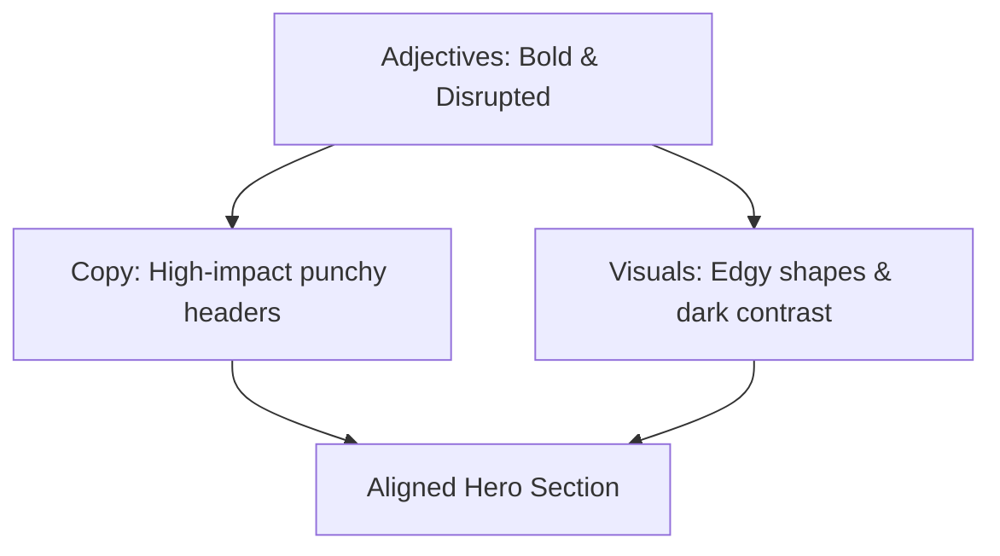

# Tutoriais de Identidade de Marca

Este documento fornece lições passo a passo orientadas ao aprendizado para a construção de frameworks de identidade de marca visuais e verbais. Siga estas lições para construir um sistema de marca coeso desde o início.

---

## Tutorial 1: Projetando um Sistema de Identidade Visual

Este tutorial guia você pela criação de um sistema de identidade visual fundamental. Ao final desta lição, você terá um vocabulário visual definido para a sua marca.

### Passo 1: Estabeleça um Mood Board da Marca

Reunir inspiração visual ajuda a traduzir valores estratégicos abstratos em formas, cores e layouts concretos.

* **Selecione Plataformas**: Use ferramentas como Pinterest, Behance ou Dribbble para curar imagens.
* **Colete Amostras**: Fixe de 20 a 30 imagens, incluindo fotografia, layouts de interface, espécimes de tipografia, padrões e amostras de cores.
* **Identifique Temas**: Analise a coleção para localizar padrões repetitivos, como formas orgânicas, linhas nítidas, tons suaves ou interfaces de alto contraste.

### Passo 2: Defina a Paleta de Cores

Desenvolva uma paleta composta por uma cor de marca principal, cores de suporte secundárias e tons de fundo neutros. Aplique a **regra 60-30-10**:

* **60% Tom Dominante**: Tipicamente uma cor neutra (fundo do modo claro ou escuro) que define o canvas geral.
* **30% Tom de Marca Secundário**: Usado para elementos estruturais, botões secundários e cabeçalhos.
* **10% Tom de Destaque**: Uma cor de alto contraste usada exclusivamente para chamadas para ação (CTAs) principais e pontos focais importantes.

### Passo 3: Estabeleça Regras de Tipografia

Escolha no máximo duas famílias de fontes para garantir a clareza do layout e a renderização digital rápida:

* **Fonte de Cabeçalho**: Um tipo de letra que reflita a personalidade da marca (por exemplo, uma serifa clássica para formalidade ou uma sem serifa geométrica para tecnologia moderna).
* **Fonte de Corpo**: Um tipo de letra sem serifa altamente legível, otimizado para legibilidade em tamanhos pequenos em várias resoluções de tela.
* **Definição de Escala**: Documente pareamentos claros de tamanho e peso (por exemplo, `h1` a 32px em negrito, corpo a 16px regular).

### Passo 4: Estabeleça Critérios de Design de Logo

Esboce um logotipo vetorial que escale de forma limpa em várias aplicações digitais e físicas:

* **Mantenha Simples**: Use formas geométricas simples e limite o design a uma ou duas cores.
* **Variantes Responsivas**: Defina um logotipo principal (combinação de wordmark e símbolo), um logotipo secundário (layout horizontal) e um ícone minimalista (isótipo) para favicons e pequenos quadros de avatar.
* **Teste de Legibilidade**: Verifique se o logotipo permanece legível quando reduzido a uma grade de 16x16 pixels.

---

## Tutorial 2: Criando um Framework de Identidade Verbal

Este tutorial descreve o processo para definir a voz de comunicação de uma marca, pilares de mensagens e padrões editoriais.

### Passo 1: Identifique Adjetivos de Personalidade da Marca

Determine os principais traços do estilo de comunicação da sua marca:

* Selecione três adjetivos principais que representem como a sua marca fala (por exemplo, autoritativa, inovadora, confiável).
* Certifique-se de que esses adjetivos se alinhem diretamente com a estratégia geral da sua marca.

### Passo 2: Formule Princípios de Voz "Isto, mas não Aquilo"

Crie diretrizes para a sua voz para evitar que redatores se dispersem em estilos extremos ou inadequados:

* Pegue cada adjetivo de personalidade e defina o limite positivo dele.
* **Exemplo de Formulação**:
  * "Somos *inovadores*, mas não *exageramos nas promessas*."
  * "Somos *autoritativos*, mas não *sem graça*."
  * "Somos *divertidos*, mas não *não profissionais*."

### Passo 3: Esboce as Declarações Estratégicas Principais

Escreva declarações claras que descrevam o que você faz, para onde está indo e por que existe:

* **Declaração de Missão**: Concentre-se na proposta de valor presente. Defina *o que* você faz, *para quem* e *como*.
* **Declaração de Visão**: Concentre-se na meta aspiracional de médio prazo. Defina o estado futuro alvo para motivar as equipes.
* **Declaração de Propósito**: Concentre-se na razão profunda de existência. Defina o impacto positivo que você pretende causar na indústria ou na sociedade.

### Passo 4: Delimite os Pilares de Mensagens da Marca

Defina três temas centrais que estruturam toda a comunicação de marketing e produtos:

* Identifique as capacidades exclusivas da sua solução.
* Para cada capacidade, extraia o benefício direto para o usuário.
* **Estrutura**: Crie um título curto, seguido por uma promessa voltada para o usuário de uma frase.

---

## Tutorial 3: Alinhando Identidade Visual e Verbal

Este tutorial detalha um exercício prático para alinhamento de layouts visuais com mensagens verbais para a seção hero de um site.

### Passo 1: Defina o Cenário

Imagine que você está construindo uma página de produto para uma ferramenta de desenvolvedor de alto desempenho. A estratégia de marca define a personalidade como *ousada*, *eficiente* e *técnica*.

### Passo 2: Esboce os Ativos Verbais

* **Headline**: Escreva um título curto na voz ativa usando recursos retóricos como tricolons (por exemplo, "Construa. Teste. Deploy.") ou antítese (por exemplo, "Zero config. Escala infinita.").
* **Sub-headline**: Mantenha-a em duas frases. Concentre-se no benefício principal para o usuário (por exemplo, "Automatize todo o seu pipeline de deploy sem sair do seu terminal.").
* **Botão de CTA**: Escreva uma cópia focada em ações (por exemplo, "Comece grátis").

### Passo 3: Selecione Ativos Visuais Correspondentes

* **Escolha de Cores**: Use um fundo no modo escuro (60%), um cinza neutro e frio para texto secundário (30%) e um verde neon vibrante ou azul elétrico como destaque (10%) para o botão de CTA.
* **Tipografia**: Aplique uma fonte monoespaçada limpa para títulos para reforçar o tema técnico e uma sem serifa geométrica neutra para o texto do corpo.
* **Imagens**: Apresente uma captura de tela limpa da interface de linha de comando ou um diagrama de fluxo vetorial simplificado em vez de fotografia de estilo de vida genérica.

### Passo 4: Verificação

Revise o layout completo. Se a cópia for técnica e direta, mas o fundo usar círculos cor-de-rosa pastéis suaves e tipografia com serifa em looping, os elementos visuais e verbais se contradizem. Substitua-os por elementos de grade estruturados e de alto contraste para restaurar a coerência.
