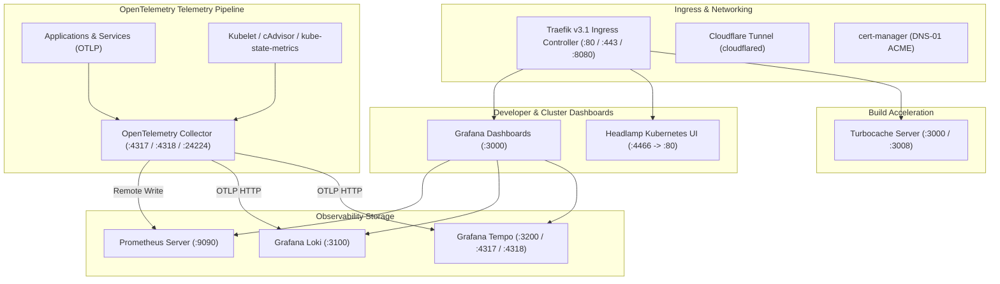

# Platform Bounded Context Architecture

Platform services operate as an always-on infrastructure foundation, providing unified telemetry ingestion, cluster administration, and build optimization:

