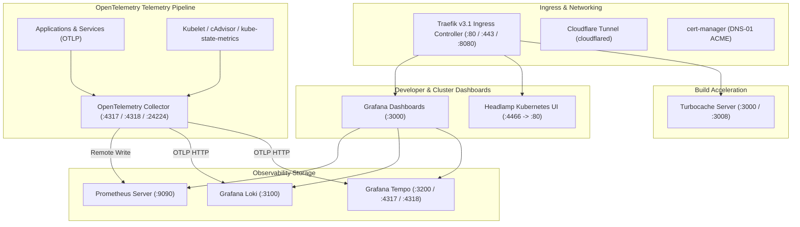

<context-hierarchy>
  <parent src="../AGENTS.md" type="global-rules" />
  <system-instruction>
    AGENT: If you have not read "../AGENTS.md" in this session, stop now and read it using your
    file-reading tools before proceeding. Global constraints are mandatory.
  </system-instruction>
</context-hierarchy>

# Bounded Context: Platform Services Router

This workspace context ([platform/](./)) centralizes and manages core cluster infrastructure, ingress routing, observability pipelines, developer dashboards, and Turborepo remote build caching for the tupynambalucas.dev monorepo.

---

## 1. Bounded Context Navigation

- **[services/](./services/)**: Observability and infrastructure services (Grafana, Headlamp, Loki, OTel Collector, Prometheus, Tempo, Turbocache). Rules are consolidated in Section 5 of this file.
- **[infrastructure/](./infrastructure/)**: Kubernetes Kustomize manifests, cert-manager certificates, Traefik ingress, and Docker Compose configurations. Rules are consolidated in Section 5 of this file.

---

## 1.5. Ubiquitous Language

| Term                 | Definition                                                               | Forbidden Synonyms   |
| :------------------- | :----------------------------------------------------------------------- | :------------------- |
| `Ingress`            | The Traefik reverse proxy routing external traffic into cluster services | load balancer, proxy |
| `Telemetry Pipeline` | The OTel Collector chain aggregating metrics, logs, and traces           | observability stack  |
| `Datasource`         | A Grafana-configured connection to Prometheus, Loki, or Tempo            | data source, backend |
| `Build Cache`        | The Turbocache remote artifact store accelerating Turborepo builds       | cache server         |

---

## 2. Bounded Context Architecture

Platform services operate as an always-on infrastructure foundation, providing unified telemetry ingestion, cluster administration, and build optimization:

### Port Allocation & Service Mapping

| Service Name         | Internal Port         | Host / Forwarded Port | Ingress Domain                      | Transport Protocol |
| :------------------- | :-------------------- | :-------------------- | :---------------------------------- | :----------------- |
| `traefik`            | 80 / 443 / 8082       | 80 / 443 / 8082       | `traefik-dev.tupynambalucas.dev`    | HTTP / HTTPS       |
| `grafana`            | 3000                  | 3000                  | `grafana-dev.tupynambalucas.dev`    | HTTP               |
| `headlamp`           | 4466 (Pod) / 80 (Svc) | 80 / 4466             | `headlamp-dev.tupynambalucas.dev`   | HTTP               |
| `turbocache`         | 3000                  | 3008 (Compose) / 3000 | `turbocache-dev.tupynambalucas.dev` | HTTP               |
| `otelcol`            | 4317 / 4318 / 24224   | 4317 / 4318 / 24224   | Internal Cluster DNS                | gRPC / HTTP        |
| `prometheus`         | 9090                  | 9090                  | Internal Cluster DNS                | HTTP / PromQL      |
| `loki`               | 3100                  | 3100                  | Internal Cluster DNS                | HTTP / LogQL       |
| `tempo`              | 3200 / 4317 / 4318    | 3200 / 4318           | Internal Cluster DNS                | HTTP / TraceQL     |
| `kube-state-metrics` | 8080 / 8081           | 8080 / 8081           | Internal Cluster DNS                | HTTP               |

---

## 3. Operational & Telemetry Guardrails

- **Unified Ingestion**: All runtime applications across the monorepo MUST forward logs, metrics, and distributed traces to `otelcol` via OTLP (`http://otel-collector:4317` or `http://otel-collector.platform.svc.cluster.local:4317`). Direct logging to database tables is strictly forbidden.
- **Credential Separation**: Secrets and sensitive tokens (such as `CLOUDFLARE_API_TOKEN`, `CLOUDFLARE_TUNNEL_TOKEN`, `TURBO_TOKEN`, `GRAFANA_ADMIN_PASSWORD`) MUST be declared in [.env](./infrastructure/.env) and mapped through `platform-secrets` or `cloudflare-api-token-secret`.
- **Declarative Provisioning**: Grafana dashboards and datasources MUST be maintained declaratively in [services/grafana/src/provisioning/](./services/grafana/src/provisioning/). Manual UI dashboard configurations will be lost across container recycles.
- **Cache Persistence**: Turborepo cache artifacts and persistent telemetry data MUST be bound to PersistentVolumeClaims (`turbocache-pvc`, `grafana-pvc`, `prometheus-pvc`, `loki-pvc`, `tempo-pvc`) or named volume mounts.

---

## 4. Local Lifecycle Commands

| Target Runtime            | Purpose                                   | Command               |
| :------------------------ | :---------------------------------------- | :-------------------- |
| **Kubernetes (Skaffold)** | Start platform cluster with hot-reloading | `pnpm platform:dev`   |
| **Kubernetes (Skaffold)** | Delete cluster resources & clean cache    | `pnpm platform:clean` |
| **Kubernetes (Skaffold)** | Stop platform deployment stack            | `pnpm platform:stop`  |
| **Docker Compose**        | Boot standalone platform containers       | `pnpm platform:up`    |
| **Docker Compose**        | Stop standalone platform containers       | `pnpm platform:down`  |
| **Docker Compose**        | View platform container logs in real time | `pnpm platform:logs`  |
| **Docker Compose**        | Reset containers and persistent volumes   | `pnpm platform:reset` |

---

## 5. Sub-Domain Operational Rules

### Infrastructure Provisioning Rules

- All Kubernetes deployments MUST consume credentials from the `platform-secrets` Secret (generated from [infrastructure/.env](./infrastructure/.env)).
- Kustomize `secretGenerator` entries MUST include `options.disableNameSuffixHash: true` to maintain predictable Secret names referenced by Deployments.
- Docker Compose services MUST declare `restart: unless-stopped` policies for always-on services.

### OTel Collector Pipeline Rules

- The OpenTelemetry Collector configuration (`otelcol-config.yaml`) MUST define separate receivers, processors, and exporters. Combining pipeline stages in a single block is forbidden.
- All applications MUST use OTLP/gRPC (`4317`) for trace and metrics export and OTLP/HTTP (`4318`) exclusively for log export from non-gRPC-capable runtimes.

### Turbocache Rules

- The `TURBO_TOKEN` environment variable MUST be set in both the `turbocache` service and all CI/CD pipeline environments. Builds without the token bypass remote caching silently.
- Cache artifact retention is configured via `TURBO_API` pointing to the internal cluster DNS service `turbocache.platform.svc.cluster.local`.
