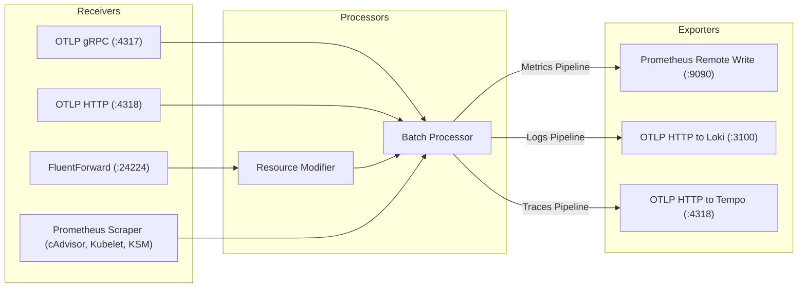

# Local Context: OpenTelemetry Collector Monitoring Service

This service directory ([otelcol/](./)) manages telemetry ingestion pipelines, custom collector distribution building, and routing of metrics, logs, and traces across the platform.

---

## 1. Directory Layout

- **[src/builder-config.yaml](./src/builder-config.yaml)**: OpenTelemetry Collector Builder (OCB v0.158.0) distribution manifest defining compiled receivers, processors, and exporters.
- **[src/collector-config.yaml](./src/collector-config.yaml)**: Runtime telemetry pipeline configuration specifying receivers, processors, and downstream storage exporters.
- **[Dockerfile](./Dockerfile)**: Multi-stage build compiling the custom collector binary with Golang and packaging it into a minimal distroless image.

---

## 2. Telemetry Pipeline Architecture

---

## 3. Guardrails & Architecture Rules

- **Unified Ingress Ports**: Telemetry MUST enter through `4317` (OTLP gRPC), `4318` (OTLP HTTP), or `24224` (FluentForward).
- **Cluster Scrape Targets**: In Kubernetes mode, the Prometheus receiver scrapes cAdvisor at `/api/v1/nodes/<node>/proxy/metrics/cadvisor` and `kube-state-metrics` at `kube-state-metrics.platform.svc.cluster.local:8080`.
- **Downstream Dispatch**: Metrics MUST be exported via `prometheusremotewrite` to Prometheus (`:9090`), logs via `otlphttp` to Loki (`:3100`), and traces via `otlphttp` to Tempo (`:4318`).
- **Live Configuration Sync**: Changes to [src/collector-config.yaml](./src/collector-config.yaml) are synced live to `/otelcol/collector-config.yaml` inside the running pod during `pnpm platform:dev`.
