<!-- Note: This profile README is dynamically updated by the TypeScript-based generator in the ./renderer workspace -->

**Full-Stack Engineer** with over 10 years of experience and studies in software development, building production systems in TypeScript from end to end. I make architectural decisions driven by requirements, not by trends — selecting the right database, framework, or protocol for each problem. My current expertise runs deep in MongoDB replica sets with ACID transactions, but I reach for PostgreSQL or Redis when the domain calls for it. I design domain-driven monorepos orchestrated by Turborepo with strict catalog-managed dependencies, ship high-performance APIs on Fastify with Redis-backed job queues, and craft interactive frontends with React 19, Three.js, and GSAP. My infrastructure runs on Docker and Kubernetes with Traefik ingress, OpenTelemetry-instrumented observability pipelines exporting to Grafana Cloud, and multi-environment promotion from dev to production. I architect AI-native toolchains — self-hosted MCP gateway federations, containerized agent runtimes, and vector memory layers — turning autonomous workflows into first-class infrastructure. Every repository I own ships with automated CI/CD, Conventional Commits, and security hardened by design.

<p align="center">
  {{ overviewImages }}&nbsp;&nbsp;{{ languagesImages }}
</p>

<details>
<summary><strong>Developer Overview: Monorepo Architecture & Services</strong></summary>

# %PROJECT_DOMAIN% Monorepo

High-performance, domain-driven monorepo powering the `%PROJECT_DOMAIN%` developer platform. Built on TypeScript, PNPM Workspaces, and Turborepo with Kubernetes-native orchestration via Skaffold.

> [!NOTE]
> **Documentation:** Full architectural deep dives and developer guides are available at [%PROJECT_DOCS_URL%](%PROJECT_DOCS_URL%).

---

## Architecture Overview

The codebase is organized into isolated **Bounded Contexts**, each owning its own infrastructure manifests, Kubernetes namespace, and lifecycle scripts. Three Skaffold modules (`platform-dev`, `cortex-dev`, `studio-dev`) compose the full local Kubernetes development cluster, with `platform-dev` serving as the required infrastructure foundation for all downstream modules.

```mermaid
graph TD
  direction TB

  subgraph IngressLayer ["Ingress Layer (platform namespace)"]
    Cloudflared["cloudflared Tunnel"]
    Traefik["Traefik v3.1 Ingress Controller"]
    CertManager["cert-manager (DNS-01 ACME)"]
    Cloudflared --> Traefik
  end

  subgraph PlatformServices ["Platform Services (platform namespace)"]
    OtelCol["OpenTelemetry Collector"]
    Prometheus["Prometheus"]
    Loki["Grafana Loki"]
    Tempo["Grafana Tempo"]
    Grafana["Grafana Dashboards"]
    Headlamp["Headlamp K8s UI"]
    TurboCache["Turbocache Remote Cache"]

    OtelCol -->|metrics| Prometheus
    OtelCol -->|logs| Loki
    OtelCol -->|traces| Tempo
    Grafana --> Prometheus
    Grafana --> Loki
    Grafana --> Tempo
  end

  subgraph CortexServices ["Cortex AI Services (cortex namespace)"]
    AgentGateway["AgentGateway MCP Proxy"]
    Guardrails["MCP Guardrails (CEL)"]
    MemoryAPI["Memory API (Fastify)"]
    MemoryWeb["Memory Dashboard (React)"]
    MCPInspector["MCP Inspector"]
    MongoDB[("MongoDB (Vector RAG)")]

    AgentGateway --> Guardrails
    AgentGateway --> MemoryAPI
    MemoryAPI --> MongoDB
    MemoryWeb --> MemoryAPI
  end

  subgraph StudioServices ["Studio Services (studio namespace)"]
    PenpotFE["Penpot Frontend"]
    PenpotBE["Penpot Backend"]
    PenpotExporter["Penpot Exporter"]
    PenpotAide["Penpot Aide AI (MCP)"]
    Valkey["Valkey Cache"]
    Memos["Memos Notes"]
    NeonDB[("Neon Serverless Postgres")]

    PenpotFE --> PenpotBE
    PenpotFE --> PenpotExporter
    PenpotBE --> Valkey
    PenpotBE --> NeonDB
    Memos --> NeonDB
  end

  subgraph HubServices ["Hub Services (Podman)"]
    HubWeb["Web Client (React 19)"]
    HubAPI["REST API (Fastify 5)"]
    HubCore["Core Library (Zod)"]
    HubMongo[("MongoDB rs0")]
    HubRedis[("Redis / BullMQ")]

    HubWeb --> HubAPI
    HubAPI --> HubCore
    HubAPI --> HubMongo
    HubAPI --> HubRedis
  end

  Traefik --> AgentGateway
  Traefik --> Grafana
  Traefik --> Headlamp
  Traefik --> TurboCache
  Traefik --> PenpotFE
  Traefik --> Memos
  HubWeb -.->|design tokens| PenpotBE
```



---

## Bounded Contexts

> [!TIP]
> Each directory operates as an independent domain. Refer to their individual `README.md` files for targeted deployment instructions.

### [Hub](./hub/README.md)

Personal developer portal, blog engine, and administration dashboard.

| Package              | Role        | Stack                                     |
| :------------------- | :---------- | :---------------------------------------- |
| `@monorepo/hub-web`  | Application | React 19, Vite 8, Zustand, TailwindCSS v4 |
| `@monorepo/hub-api`  | Application | Fastify 5, Mongoose, BullMQ, Zod          |
| `@monorepo/hub-core` | Library     | Zod schemas, shared contracts (SSOT)      |

### [Cortex](./cortex/README.md)

Unified AI processing hub with MCP gateway federation, vector memory, and agent runtimes.

| Domain     | Purpose                                           | Key Service         |
| :--------- | :------------------------------------------------ | :------------------ |
| `gateway/` | Go-based MCP ingress proxy with CEL guardrails    | `agentgateway:8080` |
| `memory/`  | MongoDB Vector RAG memory (API + React dashboard) | `memory-api:3006`   |
| `mcp/`     | Downstream MCP adapter services and tools         | Per-adapter ports   |
| `agents/`  | Containerized AI agent terminal runtimes          | Claude, Gemini CLI  |

### [Studio](./studio/README.md)

Brand identity management, collaborative design infrastructure, and asset synchronization.

| Package / Service         | Role          | Stack                                        |
| :------------------------ | :------------ | :------------------------------------------- |
| `@monorepo/studio-assets` | Library       | CSS tokens, React SVG icons                  |
| `@monorepo/studio-bucket` | CLI Tool      | AWS SDK (Cloudflare R2), Glob                |
| Penpot v2 (5 containers)  | Design Engine | Frontend, Backend, Exporter, Valkey, Aide AI |
| Memos                     | Notes         | Lightweight collaborative notes              |

### [Platform](./platform/README.md)

Always-on cluster infrastructure, observability pipelines, and build acceleration.

| Service                 | Port | Purpose                                 |
| :---------------------- | :--- | :-------------------------------------- |
| Traefik v3.1            | 80   | Kubernetes Ingress Controller           |
| OpenTelemetry Collector | 4317 | Metrics, logs, and traces aggregation   |
| Prometheus              | 9090 | Time-series metrics storage             |
| Grafana Loki            | 3100 | Log aggregation and LogQL queries       |
| Grafana Tempo           | 3200 | Distributed trace storage and TraceQL   |
| Grafana                 | 3000 | Unified observability dashboards        |
| Headlamp                | 4466 | Kubernetes cluster administration UI    |
| Turbocache              | 3000 | Turborepo remote build cache            |
| cloudflared             | -    | Cloudflare Tunnel for Zero Trust access |
| cert-manager            | -    | Automated TLS via Let's Encrypt DNS-01  |

### Workspace Utilities

- **[`renderer/`](./renderer/README.md)**: Dynamic asset generator compiling GitHub profile stats into SVG cards and templated Markdown documents.
- **[`shared/`](./shared/README.md)**: Foundational utilities, global configuration, and Git lifecycle hooks.
- **[`tools/`](./tools/README.md)**: Developer automation, repository provisioning scripts, and containerized Git environments.
- **[`docs/`](./docs/README.md)**: Centralized knowledge base built with Docusaurus v3 under the Diataxis framework.

---

## Technology Stack

| Layer                 | Technologies                                                     |
| :-------------------- | :--------------------------------------------------------------- |
| **Runtime**           | Node.js 22+, TypeScript 6, ESM modules                           |
| **Package Manager**   | PNPM v11 (Catalogs, Workspaces, strict symlinks)                 |
| **Task Orchestrator** | Turborepo (parallel pipelines, remote caching via Turbocache)    |
| **Backend**           | Fastify 5, Mongoose, BullMQ, Zod                                 |
| **Frontend**          | React 19, Vite 8, Zustand, TailwindCSS v4, GSAP, Three.js        |
| **Containers**        | Podman (Hub), Kubernetes v1.30+, Skaffold v4beta11               |
| **Ingress**           | Traefik v3.1, Cloudflare Tunnel, cert-manager (DNS-01 ACME)      |
| **Observability**     | OpenTelemetry Collector, Prometheus, Grafana Loki, Grafana Tempo |
| **AI Infrastructure** | AgentGateway (Go), MCP protocol, MongoDB Vector Search           |
| **Design**            | Penpot v2 (self-hosted), Memos, Cloudflare R2                    |
| **Documentation**     | Docusaurus v3, MDX, Mermaid, Diataxis framework                  |
| **Quality**           | ESLint 10 (flat config), Prettier 3, Husky, Conventional Commits |
| **CI/CD**             | GitHub Actions, Cloudflare Pages, Changesets                     |

---

## Getting Started

> [!WARNING]
> Before deploying, you must configure all environment variables via `infrastructure/.env`.

### Prerequisites

Install the following on your development machine:

```bash
# Package management and container runtime
winget install RedHat.Podman-Desktop RedHat.Podman

# Kubernetes toolchain
winget install Kubernetes.minikube Kubernetes.kubectl Google.Skaffold
```

### Installation

```bash
git clone https://github.com/%GITHUB_ORG%/%REPOSITORY_NAME%.git
cd %REPOSITORY_NAME%
pnpm install
```

---

## Orchestration

The monorepo uses a unified Kubernetes-native orchestration model. All infrastructure commands are defined in the root [`package.json`](./package.json) and executed via `pnpm`.

### Kubernetes (Skaffold + Minikube)

Deploy the complete development cluster with automatic port forwarding and hot-reloading:

```bash
pnpm minikube:up
pnpm minikube:tunnel    # Required in a separate terminal for LoadBalancer IPs

# Deploy and stream the full stack (platform + cortex + studio)
pnpm infra:dev

# Tear down all cluster resources
pnpm infra:delete
```

### Hub Services (Podman)

The Hub workspace uses standalone Podman containers for local development:

```bash
pnpm hub:dev            # API + Web + DB with hot-reload
pnpm hub:up             # Start containers only
pnpm hub:down           # Stop containers
pnpm hub:reset          # Reset containers and volumes
```

---

## Quality Assurance

```bash
pnpm typecheck          # TypeScript validation across all workspaces
pnpm lint               # ESLint verification across all workspaces
pnpm build              # Production build for all packages
pnpm format:check       # Prettier formatting verification
pnpm format:write       # Auto-fix formatting issues
```

---

## Versioning and Releases

The project uses [Changesets](https://github.com/changesets/changesets) for version management and follows [Conventional Commits](https://www.conventionalcommits.org/) for structured commit history.

```bash
pnpm version:changeset  # Create a new changeset
pnpm version:bump       # Bump versions based on changesets
pnpm version:publish    # Publish updated packages
```

---

## License

This project is licensed under the [MIT License](./LICENSE.md).

</details>
