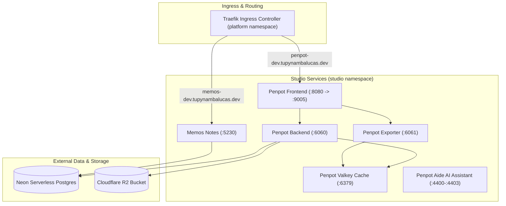

# Studio Bounded Context Architecture

This diagram illustrates the ingress routing, services, and external storage relationships for the Studio bounded context.

```mermaid
flowchart TD
  subgraph IngressLayer ["Ingress & Routing"]
    Traefik["Traefik Ingress Controller (platform namespace)"]
  end

  subgraph StudioServices ["Studio Services (studio namespace)"]
    PenpotFrontend["Penpot Frontend (:8080 -> :9005)"]
    PenpotBackend["Penpot Backend (:6060)"]
    PenpotExporter["Penpot Exporter (:6061)"]
    PenpotValkey["Penpot Valkey Cache (:6379)"]
    PenpotAide["Penpot Aide AI Assistant (:4400-:4403)"]
    MemosService["Memos Notes (:5230)"]

    PenpotFrontend --> PenpotBackend
    PenpotFrontend --> PenpotExporter
    PenpotBackend --> PenpotValkey
    PenpotExporter --> PenpotValkey
  end

  subgraph ExternalStorage ["External Data & Storage"]
    NeonDB[("Neon Serverless Postgres")]
    R2Bucket[("Cloudflare R2 Bucket")]

    PenpotBackend --> NeonDB
    PenpotBackend --> R2Bucket
    MemosService --> NeonDB
  end

  Traefik -->|penpot-dev.tupynambalucas.dev| PenpotFrontend
  Traefik -->|memos-dev.tupynambalucas.dev| MemosService
```
