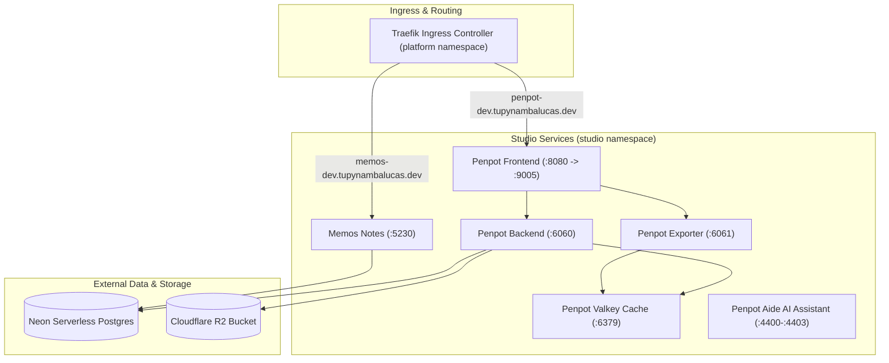

# Bounded Context: Studio Workspace Router

This workspace context ([studio/](./)) defines domain rules, design tokens, asset synchronization pipelines, and containerized design collaboration infrastructure for the **Studio Bounded Context**.

---

## 1. Directory Layout

- **[assets/](./assets/AGENTS.md)**: Brand identity assets, design tokens, theme configurations, and React SVG icon library under `@tupynambalucas-studio/assets` ([assets/AGENTS.md](./assets/AGENTS.md)).
- **[bucket/](./bucket/AGENTS.md)**: Cloudflare R2 asset synchronization CLI tool under `@tupynambalucas-studio/bucket` ([bucket/AGENTS.md](./bucket/AGENTS.md)).
- **[creative/](./creative/)**: Raw creative design sources, master Illustrator/Photoshop files, and vector graphics.
- **[infrastructure/](./infrastructure/AGENTS.md)**: Containerized Docker Compose and Kubernetes deployment manifests for Penpot v2 and Memos ([infrastructure/AGENTS.md](./infrastructure/AGENTS.md)).

---

## 2. Bounded Context Architecture

### Service Mapping & Port Allocation

| Service           | Internal Port | Host / Forwarded Port | Ingress Host                    | Protocol    |
| :---------------- | :------------ | :-------------------- | :------------------------------ | :---------- |
| `penpot-frontend` | 8080          | 9005                  | `penpot-dev.tupynambalucas.dev` | HTTP        |
| `penpot-backend`  | 6060          | 6060                  | Internal Cluster DNS            | HTTP        |
| `penpot-exporter` | 6061          | 6061                  | Internal Cluster DNS            | HTTP        |
| `valkey`          | 6379          | 6379                  | Internal Cluster DNS            | TCP (Redis) |
| `penpot-aide`     | 4400-4403     | 4400-4403             | Internal Cluster DNS            | HTTP / MCP  |
| `memos`           | 5230          | 5230                  | `memos-dev.tupynambalucas.dev`  | HTTP        |

---

## 3. Architectural Principles & Guardrails

1. **Token Invariance**: Brand CSS color tokens and variables MUST be maintained in [assets/tokens/](./assets/tokens/). AI agents MUST NEVER define hardcoded hex values in local application CSS modules.
2. **Asset Governance**: Raw vector logos MUST be placed in [assets/brand/logos/](./assets/brand/logos/) and web-ready icon components inside [assets/icons/](./assets/icons/). Heavy binary backups MUST NOT be committed to Git.
3. **Secrets Isolation**: Local variables and database strings MUST be defined in [.env](./infrastructure/.env) and mapped into container environments via `studio-secrets` in Kubernetes or `--env-file` in Docker Compose.
4. **Skaffold Dependency**: Studio requires `platform-dev` ([platform/skaffold.yaml](../platform/skaffold.yaml)). Whenever Studio runs in Kubernetes via Skaffold, Platform infrastructure starts automatically.

---

## 4. Scoped Operations

| Target Runtime            | Purpose                                                  | Command                 |
| :------------------------ | :------------------------------------------------------- | :---------------------- |
| **Kubernetes (Skaffold)** | Start Studio & Platform in Kubernetes with hot-reloading | `pnpm studio:dev`       |
| **Kubernetes (Skaffold)** | Delete Studio cluster resources                          | `pnpm studio:clean`     |
| **Kubernetes (Skaffold)** | Stop Studio deployment stack                             | `pnpm studio:stop`      |
| **Docker Compose**        | Boot standalone Studio containers                        | `pnpm studio:up`        |
| **Docker Compose**        | Stop standalone Studio containers                        | `pnpm studio:down`      |
| **Docker Compose**        | View Studio container logs in real time                  | `pnpm studio:logs`      |
| **Docker Compose**        | Reset Studio container volumes                           | `pnpm studio:reset`     |
| **R2 Asset Sync**         | Run Cloudflare R2 bucket asset synchronization           | `pnpm studio:bucket`    |
| **Typecheck**             | Run TypeScript validation across studio packages         | `pnpm studio:typecheck` |
| **Lint**                  | Run ESLint validation across studio packages             | `pnpm studio:lint`      |
