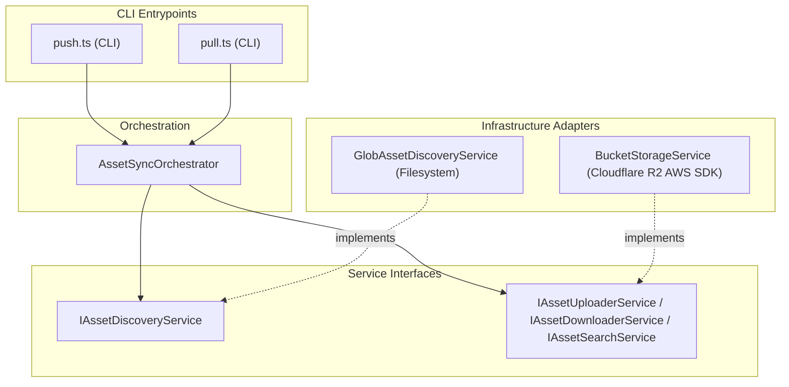

# @tupynambalucas-studio/assets - Studio Design Assets

This package houses the design assets and dynamic asset synchronization engine for the tupynambalucas.dev Studio workspace. It provides bidirectional (`push` and `pull`) replication of web-ready assets (e.g., images, 3D assets/Three.js vectors, and raw backups) directly with Cloudflare R2 Object Storage.

---

## Architecture Overview

The sync tool is built on clean domain separation and dependency injection principles, abstracting the storage provider (S3 SDK) and filesystem scanner (Glob).



---

## Directory Structure

- **`application/`**:
  - `sync.orchestrator.ts`: Coordinate the main sync sequence. Compares file sizes and MD5 hashes locally with R2 object size and ETag to avoid redundant uploads and downloads.
- **`config/`**:
  - `env-config.ts`: Loads, parses, and validates the environment variables from `.env.studio.bucket`.
- **`services/`**:
  - `bucket-storage.service.ts`: Wrapper for `@aws-sdk/client-s3` to list, upload, and download assets.
  - `glob-discovery.service.ts`: Uses standard glob patterns to recursively find local files under directory rules.
- **`bucket.interface.ts`**: Standard type contracts, interface definitions, and bucket manifest schemas.
- **`infrastructure/cli/`**:
  - `push.command.ts`: SOLID encapsulation of the local asset scan and R2 push synchronization flow.
  - `pull.command.ts`: SOLID encapsulation of the remote metadata check and local pull synchronization flow.
- **`bucket.ts`**: Main CLI interactive entrypoint utilizing `@clack/prompts` and directing operations based on user menu selections.

---

## Optimization & Free-Tier Safety

To avoid excess API usage costs and operate strictly within Cloudflare R2's free limit (10GB storage, 1M Class A operations/month, 10M Class B operations/month):

- **Zero Redundant Writes**: Uses local MD5 calculation and remote ETag comparison.
- **Direct Root Uploads**: Uploads are performed directly to the root of the bucket (e.g., `images/...` or `raw/...`) based on the paths configured in `studio/assets-manifest.json` instead of adding nested path layers like `studio/`.
- **Dynamic File Discovery**: Automatically targets specific assets folder structures defined in `studio/assets-manifest.json`.

---

## Environment Configuration

Configure the synchronizer using `.env.studio.bucket` in the `bucket/` directory:

```bash
# Path: studio/assets/bucket/.env.studio.bucket

S3_API=https://your-cloudflare-r2-endpoint.r2.cloudflarestorage.com/your-bucket-name
CLOUDFLARE_R2_ACCESS_KEY_ID=your_access_key_id
CLOUDFLARE_R2_SECRET_ACCESS_KEY=your_secret_access_key
CLOUDFLARE_R2_PUBLIC_URL=https://your-public-cdn-url.r2.dev
```

---

## Sychronization Commands

Execute the main interactive wizard from the monorepo root:

```bash
pnpm studio:bucket
```

This starts a polished, command-line selection interface. Use the up and down arrow keys to choose:

- **Push**: Scan and synchronize local modified files directly to R2.
- **Pull**: Check R2 object metadata and download any new or updated files locally.
- **Exit**: Safely terminate the CLI.
