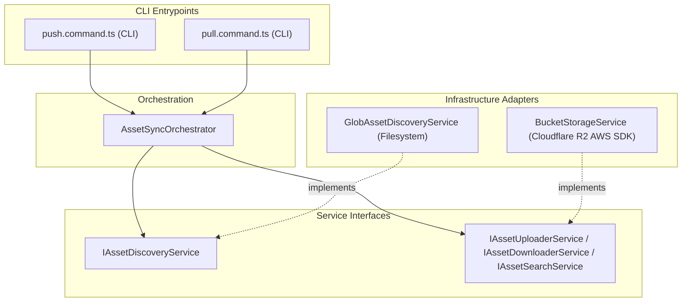

# @tupynambalucas-studio/bucket - Studio Bucket Synchronizer

This package houses the dynamic asset synchronization engine for the tupynambalucas Studio workspace. It provides bidirectional (`push` and `pull`) replication of web-ready assets (e.g., images, 3D assets/Three.js vectors, and raw backups) directly with Cloudflare R2 Object Storage.

---

## Architecture Overview

The sync tool is built on clean domain separation and dependency injection principles, abstracting the storage provider (S3 SDK) and filesystem scanner (Glob).



---

## Directory Structure

- **[src/application/](./src/application/)**: Coordinates the main sync sequence by comparing file sizes and MD5 hashes to prevent redundant writes.
- **[src/config/](./src/config/)**: Loads, parses, and validates the synchronizer variables from `.env.studio.bucket`.
- **[src/services/](./src/services/)**: S3 storage integrations and glob filesystem discovery implementations.
- **[src/infrastructure/cli/](./src/infrastructure/cli/)**: Interactive console push/pull commands orchestration.

---

## Optimization & Free-Tier Safety

To avoid excess API usage costs and operate strictly within Cloudflare R2's free limit (10GB storage, 1M Class A operations/month, 10M Class B operations/month):

- **Zero Redundant Writes**: Uses local MD5 calculation and remote ETag comparison.
- **Direct Root Uploads**: Uploads are performed directly to the root of the bucket (e.g., `images/...` or `raw/...`) based on the paths configured in `studio/design/assets/assets-manifest.json` instead of adding nested path layers like `studio/`.
- **Dynamic File Discovery**: Automatically targets specific assets folder structures defined in `studio/design/assets/assets-manifest.json`.

---

## Environment Configuration

Configure the synchronizer using `.env.studio.bucket` in the root of the package:

```bash
# Path: studio/bucket/.env.studio.bucket

# Cloudflare R2 account identifier
CLOUDFLARE_R2_ACCOUNT_ID=your_cloudflare_r2_account_id

# Public Web Assets Bucket Configuration (CI/CD and CDN Safe)
CLOUDFLARE_R2_ASSETS_ACCESS_KEY_ID=your_cloudflare_r2_assets_access_key_id
CLOUDFLARE_R2_ASSETS_SECRET_ACCESS_KEY=your_cloudflare_r2_assets_secret_access_key
CLOUDFLARE_R2_ASSETS_BUCKET_NAME=your_cloudflare_r2_assets_bucket_name
CLOUDFLARE_R2_ASSETS_PUBLIC_URL=your_cloudflare_r2_assets_public_url

# Private Creative/Design Bucket Configuration (Restricted to Designers)
CLOUDFLARE_R2_CREATIVE_ACCESS_KEY_ID=your_cloudflare_r2_creative_access_key_id
CLOUDFLARE_R2_CREATIVE_SECRET_ACCESS_KEY=your_cloudflare_r2_creative_secret_access_key
CLOUDFLARE_R2_CREATIVE_BUCKET_NAME=your_cloudflare_r2_creative_bucket_name
CLOUDFLARE_R2_CREATIVE_PUBLIC_URL=your_cloudflare_r2_creative_public_url
```

---

## Synchronization Commands

Execute the main interactive wizard from the monorepo root:

```bash
pnpm studio:bucket
```

This starts a polished, command-line selection interface. Use the up and down arrow keys to choose:

- **Push**: Scan and synchronize local modified files directly to R2.
- **Pull**: Check R2 object metadata and download any new or updated files locally.
- **Exit**: Safely terminate the CLI.
