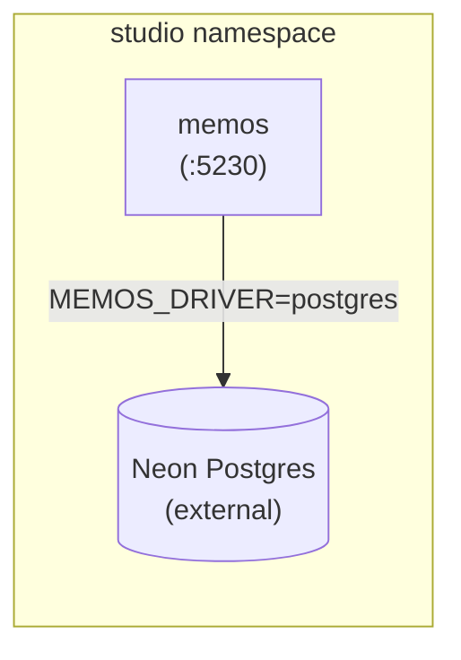

<context-hierarchy>
  <parent src="../../AGENTS.md" type="global-rules" />
  <parent src="../AGENTS.md" type="bounded-context-rules" />
  <system-instruction>
    AGENT: If you have not read "../../AGENTS.md" and "../AGENTS.md" in this session, stop now
    and read both files using your file-reading tools before proceeding. Both global constraints
    and bounded context rules are mandatory.
  </system-instruction>
</context-hierarchy>

# Local Context: Memos Notes Platform

This workspace ([memos/](./)) contains the container build definition for the Memos self-hosted
note-taking service deployed in the `studio` namespace. Read [../AGENTS.md](../AGENTS.md) for the
parent bounded context rules before operating here.

---

## 1. Directory Layout

- **[services/memos/](./services/memos/)**: Alpine Go binary container — [Dockerfile](./services/memos/Dockerfile), wraps `neosmemo/memos:stable`.

---

## 2. Architecture

### Service Mapping

| Service | Dockerfile                                               | Port   | Upstream Image          |
| :------ | :------------------------------------------------------- | :----- | :---------------------- |
| `memos` | [services/memos/Dockerfile](./services/memos/Dockerfile) | `5230` | `neosmemo/memos:stable` |

---

## 3. Dockerfile Guardrails

- The Dockerfile MUST declare both `dev` and `prod` multi-stage targets.
- The `stable` tag MUST be used. Floating `latest` is forbidden.
- The Skaffold artifact name is `studio-memos`. MUST NOT be renamed without updating
  [infrastructure/skaffold.yaml](../../../../infrastructure/skaffold.yaml) and
  [infrastructure/manifests/studio-memos.yaml](../../../../infrastructure/manifests/studio-memos.yaml).

---

## 4. Runtime Guardrails

- `MEMOS_DRIVER` MUST be set to `postgres` in cluster deployments. The default SQLite driver is
  forbidden outside of local single-node testing.
- The data volume MUST be mounted at `/var/opt/memos` inside the container. Changing the mount
  path breaks persistence across pod restarts.
- The upstream image runs as non-root UID `10001` (`nonroot`). Adding a `USER root` instruction
  to the Dockerfile is forbidden.
