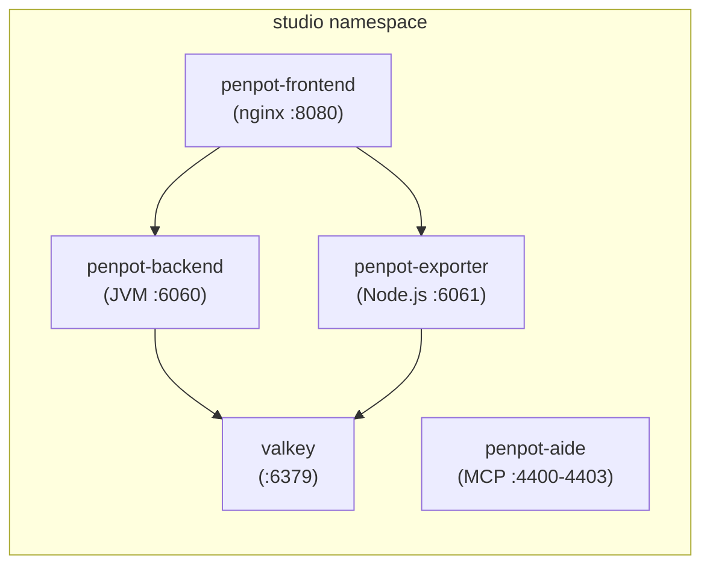

<context-hierarchy>
  <parent src="../../AGENTS.md" type="global-rules" />
  <parent src="../AGENTS.md" type="bounded-context-rules" />
  <system-instruction>
    AGENT: If you have not read "../../AGENTS.md" and "../AGENTS.md" in this session, stop now
    and read both files using your file-reading tools before proceeding. Both global constraints
    and bounded context rules are mandatory.
  </system-instruction>
</context-hierarchy>

# Local Context: Penpot Design Platform

This workspace ([penpot/](./)) contains the container build definitions for all Penpot v2 services
deployed in the `studio` namespace. Read [../AGENTS.md](../AGENTS.md) for the parent bounded
context rules before operating here.

---

## 1. Directory Layout

- **[services/frontend/](./services/frontend/)**: Nginx SPA container — [Dockerfile](./services/frontend/Dockerfile), wraps `penpotapp/frontend`.
- **[services/backend/](./services/backend/)**: Clojure/JVM REST API and WebSocket server — [Dockerfile](./services/backend/Dockerfile), wraps `penpotapp/backend`.
- **[services/exporter/](./services/exporter/)**: Node.js + Playwright PDF and PNG export — [Dockerfile](./services/exporter/Dockerfile), wraps `penpotapp/exporter`.
- **[services/aide/](./services/aide/)**: MCP AI assistant server — [Dockerfile](./services/aide/Dockerfile), wraps `penpotapp/mcp`.
- **[services/valkey/](./services/valkey/)**: Redis-compatible cache — [Dockerfile](./services/valkey/Dockerfile), wraps `valkey/valkey:alpine`.

---

## 2. Architecture

### Service Mapping

| Service           | Dockerfile                                                     | Port        | Upstream Image         |
| :---------------- | :------------------------------------------------------------- | :---------- | :--------------------- |
| `penpot-frontend` | [services/frontend/Dockerfile](./services/frontend/Dockerfile) | `8080`      | `penpotapp/frontend`   |
| `penpot-backend`  | [services/backend/Dockerfile](./services/backend/Dockerfile)   | `6060`      | `penpotapp/backend`    |
| `penpot-exporter` | [services/exporter/Dockerfile](./services/exporter/Dockerfile) | `6061`      | `penpotapp/exporter`   |
| `penpot-aide`     | [services/aide/Dockerfile](./services/aide/Dockerfile)         | `4400-4403` | `penpotapp/mcp`        |
| `valkey`          | [services/valkey/Dockerfile](./services/valkey/Dockerfile)     | `6379`      | `valkey/valkey:alpine` |

---

## 3. Dockerfile Guardrails

- Every Dockerfile MUST declare both `dev` and `prod` multi-stage targets. Skaffold selects
  `target: dev`; production builds select `target: prod`.
- Upstream version tags across `frontend`, `backend`, `exporter`, and `aide` Dockerfiles MUST be
  kept in sync. All four MUST reference the same Penpot release version.
- `valkey` MUST use the Alpine variant (`valkey/valkey:8.1-alpine`). Non-Alpine variants are
  forbidden to minimize image footprint.
- Floating `latest` tags are forbidden for all Penpot application services.
- Skaffold artifact names MUST NOT be renamed without simultaneously updating
  [infrastructure/skaffold.yaml](../../../../infrastructure/skaffold.yaml) and
  [infrastructure/manifests/studio-penpot.yaml](../../../../infrastructure/manifests/studio-penpot.yaml).

---

## 4. Runtime Guardrails

- Penpot MUST use Neon Serverless Postgres. Local Postgres containers are forbidden in cluster
  deployments.
- `PENPOT_FLAGS` MUST include `enable-login-with-password` and `enable-prepl-server`.
- `PENPOT_PUBLIC_URI` MUST use the external HTTPS domain for the backend. The exporter MUST use
  the internal cluster URI `http://frontend:8080` for `PENPOT_PUBLIC_URI`.
- Valkey MUST NOT be exposed via ingress. It communicates exclusively over internal cluster DNS.
- The Traefik Middleware `penpot-ws` MUST remain attached to the penpot-ingress to ensure
  WebSocket connections for real-time collaboration function correctly.
