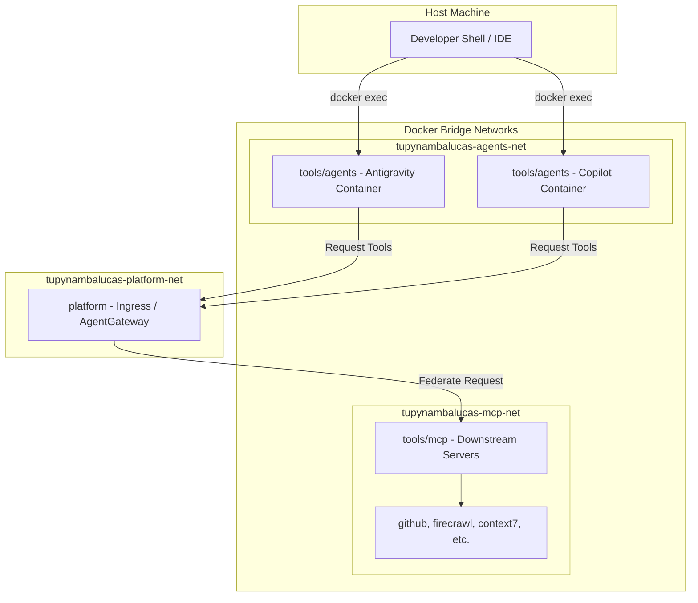

# Monorepo Developer Tools and AI Agent Workspaces

This workspace centralizes the development utilities, Model Context Protocol (MCP) integrations, git automation scripts, and containerized AI agent development platforms.

---

## 1. Directory Structure and Reference Maps

The tools folder is divided into three functional domains. Each domain contains localized specifications, design patterns, and instructions:

| Subspace      | Domain Purpose                                                             | Documentation Entry Points      | Scoped Agent Instructions       |
| :------------ | :------------------------------------------------------------------------- | :------------------------------ | :------------------------------ |
| **`mcp/`**    | Server-Sent Events (SSE) adapters and Model Context Protocol integrations. | [README.md](./mcp/README.md)    | [AGENTS.md](./mcp/AGENTS.md)    |
| **`github/`** | Git version control CLI containers and repo-wide automation scripts.       | [README.md](./github/README.md) | [AGENTS.md](./github/AGENTS.md) |
| **`agents/`** | Google Antigravity and GitHub Copilot containerized terminal shells.       | [README.md](./agents/README.md) | [AGENTS.md](./agents/AGENTS.md) |

---

## 2. Architecture and Logic Flow

The tools in this context communicate over dedicated virtual docker networks to provide an isolated runtime environment on the developer's machine:

- **Execution Isolation**: AI agent sessions execute commands in the `agents` container network. This prevents compromised tasks from affecting the host container daemon directly.
- **Unified Gateway Routing**: Agents do not connect to downstream tools directly. They send requests to the central `agentgateway` (located in the root `/platform` workspace), which federates those queries to downstream tool servers inside the `mcp` workspace.

---

## 3. Global Orchestration Scripts

All operations are run from the monorepo root folder using workspace-scoped package managers:

- **Launch MCP Servers**: `pnpm mcp:dev:up` (Stops: `pnpm mcp:dev:down`)
- **Launch GitHub Tools**: `pnpm github:services:up` (Stops: `pnpm github:services:down`)
- **Launch Agent Workspaces**: `pnpm agents:up` (Stops: `pnpm agents:down`)
- **Authenticate Agents**: `pnpm antigravity:auth` / `pnpm copilot:auth`
- **Execute Auto-scripts**: `pnpm github:generate:changelog` / `pnpm github:generate:roadmap`
